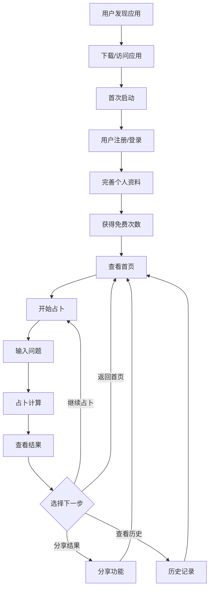
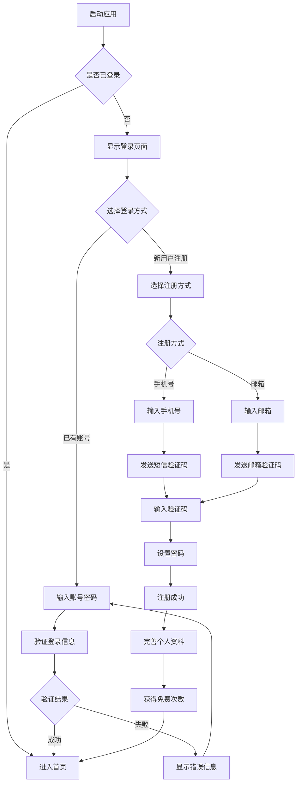
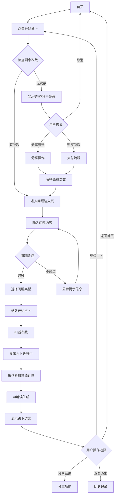
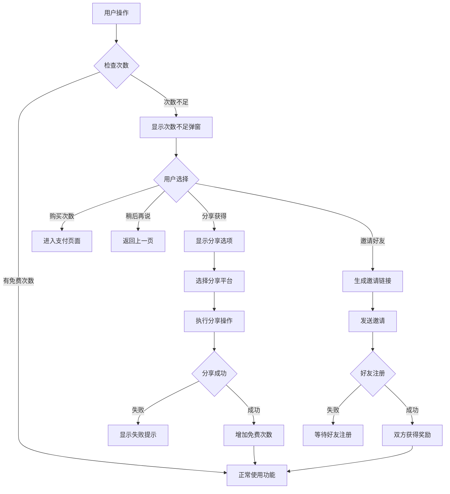
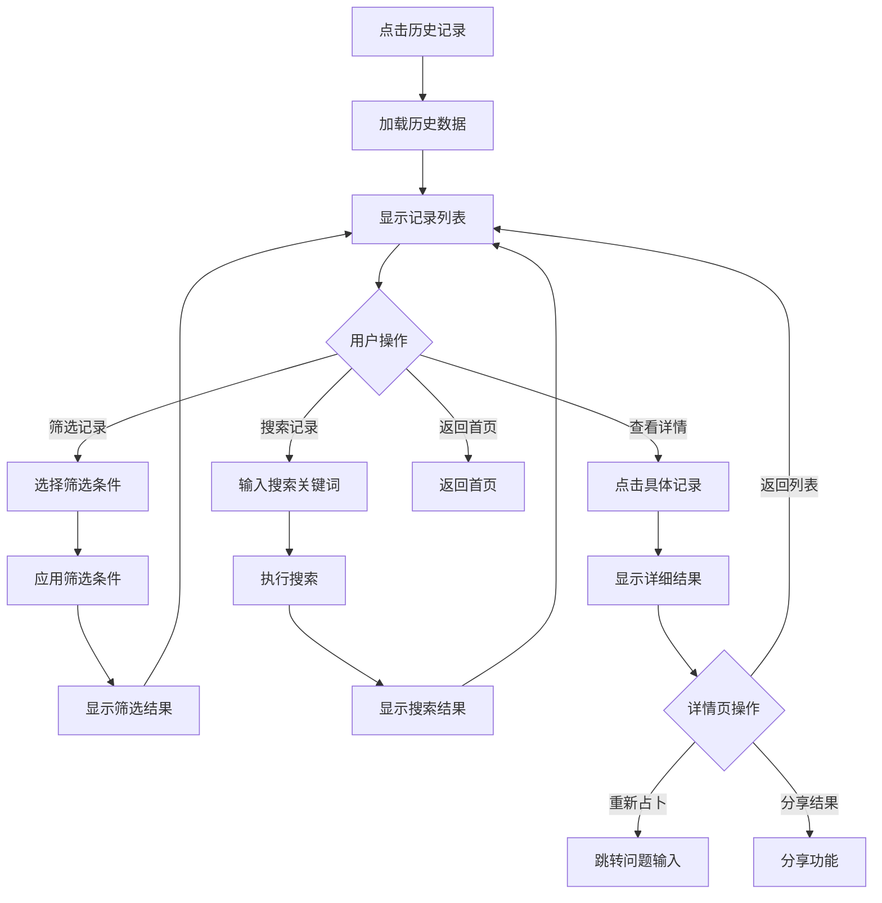
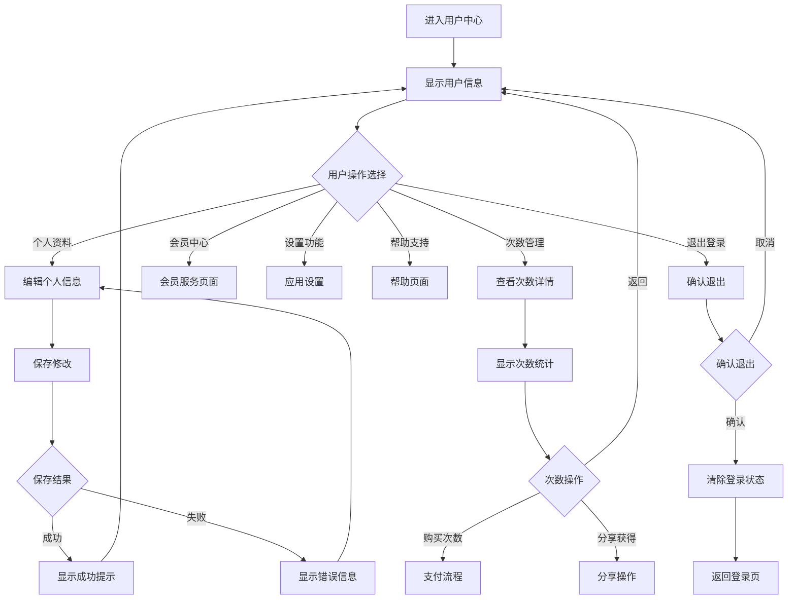
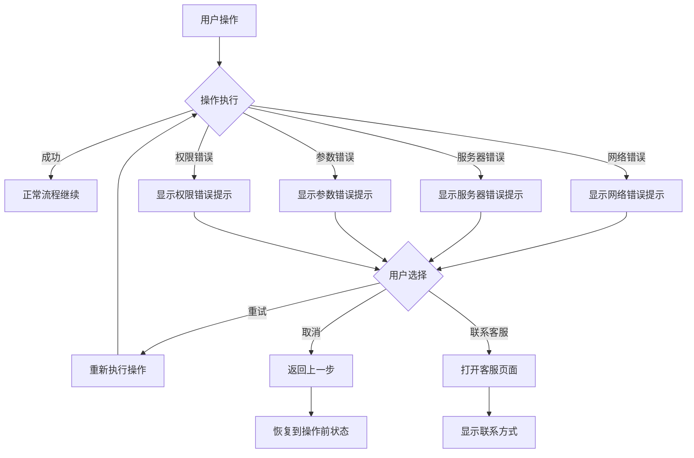
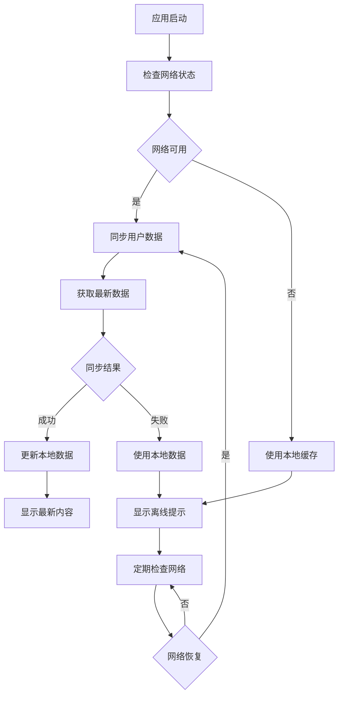

# 梅花心易占卜应用 - 用户操作流程图

## 1. 整体用户旅程流程

## 2. 用户注册登录流程

## 3. 占卜核心流程

## 4. 免费次数管理流程

## 5. 历史记录查看流程

## 6. 用户中心管理流程

## 7. 错误处理流程

## 8. 数据同步流程

---

**流程图说明**:
- 使用Mermaid语法绘制，支持在支持Mermaid的Markdown编辑器中直接渲染
- 涵盖了应用的主要用户操作流程
- 包含了异常情况的处理流程
- 可根据实际开发需求进行调整和细化

**文档版本**: v1.0  
**最后更新**: 2025-01-26  
**维护者**: 产品设计团队
