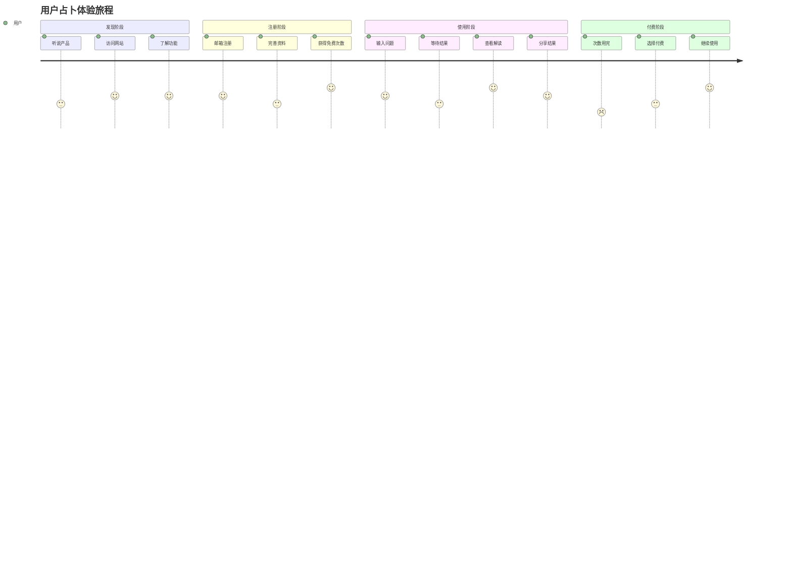
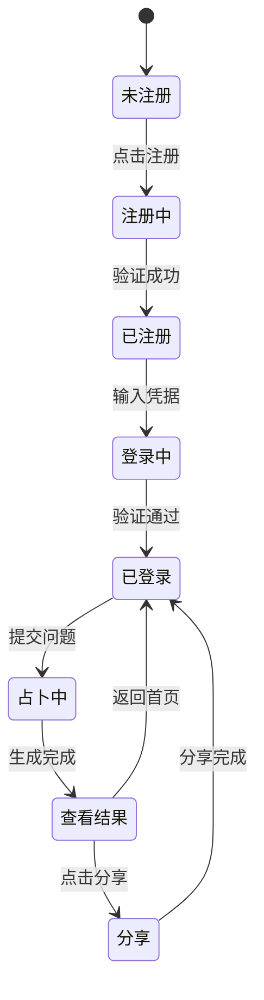

# 梅花心易占卜应用 - 产品需求文档 (PRD)

## 1. 文档信息

### 1.1 版本历史
| 版本 | 日期 | 作者 | 变更内容 |
|------|------|------|----------|
| v1.0 | 2025-7-25 | 产品经理 | 初始版本 |

### 1.2 文档目的
本文档旨在详细描述梅花心易占卜应用的产品需求，为设计、开发、测试团队提供明确的工作指导。

### 1.3 相关文档引用
- 产品路线图 (docs/Roadmap.md)
- 用户故事地图 (docs/User_Story_Map.md)
- 产品评估指标框架 (docs/Metrics_Framework.md)

## 2. 产品概述

### 2.1 产品名称与定位
**产品名称**：梅花心易
**产品定位**：基于传统梅花易数的AI智能占卜决策助手

### 2.2 产品愿景与使命
**愿景**：成为中国最受信赖的智能占卜决策平台
**使命**：运用传统易学智慧结合AI技术，帮助用户在人生选择中获得指引

### 2.3 价值主张与独特卖点(USP)
- **专业算法**：基于正宗梅花易数算法的占卜逻辑
- **AI解读**：智能AI卜算师提供个性化解读
- **小而美**：专注梅花心易，不追求功能全面性
- **高性价比**：单次1元的亲民定价策略

### 2.4 目标平台列表

#### 2.4.1 平台优先级策略
基于深度市场调研和用户行为分析，梅花心易采用"移动优先"的平台策略：

**第一优先级 - 移动端原生应用**：
- **iOS应用**：针对苹果生态用户的原生体验
- **Android应用**：覆盖安卓用户群体的主要平台
- **战略地位**：核心平台，承载主要用户流量和收入

**第二优先级 - 移动端Web应用**：
- **响应式H5**：快速获客和体验入口
- **PWA支持**：提供类原生应用体验
- **战略地位**：获客漏斗和应用下载转化

**第三优先级 - 扩展平台**：
- **微信小程序**：利用微信生态流量
- **Web端**：PC端补充覆盖
- **战略地位**：生态完善和特定场景覆盖

#### 2.4.2 移动优先策略依据

**市场数据支撑**：
- 占卜市场移动端用户占比超过80%
- 美国占星应用市场主要收入来源均为移动应用
- 竞品分析显示头部占卜应用均以移动端为主导平台

**用户行为特征**：
- **使用时间分布**：晚间21:00-23:00为使用高峰（35%），正值移动设备使用黄金时间
- **使用场景匹配**：决策困惑（40%）和情感需求（30%）多发生在私人时间和场所
- **社交分享需求**：女性用户朋友圈分享率达45%，移动端具备天然社交优势

**技术体验优势**：
- **即时性**：随时随地访问，满足用户即时占卜需求
- **私密性**：个人设备使用，保护用户隐私
- **交互体验**：触屏操作更适合占卜类应用的仪式感营造
- **功能扩展**：推送通知、地理位置、摄像头等移动端独有功能

**商业化考量**：
- **付费转化**：移动端应用内购买转化率普遍高于Web端
- **用户留存**：原生应用的用户留存率显著优于Web应用
- **运营效率**：移动端推送和用户触达更加精准有效

### 2.5 产品核心假设
- 用户对传统占卜文化有基础认知和兴趣
- AI解读能够提供比传统占卜更好的用户体验
- 低价高频的付费模式符合目标用户消费习惯

### 2.6 商业模式概述
- **免费体验**：新用户免费10次占卜
- **按次付费**：1元/次的占卜服务
- **会员制**：年费会员享受无限次数
- **邀请奖励**：邀请好友注册获得免费次数

## 3. 用户研究

### 3.1 目标用户画像

#### 3.1.1 核心用户群体分层

**主力用户群 - 都市情感决策者（占比60%）**
- **年龄分布**：25-35岁
- **性别构成**：女性75%，男性25%
- **地域特征**：一二线城市，北上广深杭为主要集中地
- **收入水平**：月收入5000-20000元
- **教育背景**：本科及以上学历占80%
- **职业分布**：白领、教师、设计师、市场营销等知识型工作

**成长用户群 - 年轻探索者（占比25%）**
- **年龄分布**：18-25岁
- **性别构成**：女性65%，男性35%
- **地域特征**：一二线城市及省会城市
- **收入水平**：月收入3000-8000元（含学生群体）
- **教育背景**：在校大学生或初入职场
- **职业分布**：学生、初级职员、服务业从业者

**潜力用户群 - 中年寻求者（占比15%）**
- **年龄分布**：35-45岁
- **性别构成**：女性70%，男性30%
- **地域特征**：一二三线城市均有分布
- **收入水平**：月收入8000-30000元
- **教育背景**：专科及以上学历
- **职业分布**：中层管理者、企业主、专业技术人员

#### 3.1.2 移动端用户行为特征

**使用时间模式**：
- **黄金时段**：晚间21:00-23:00（占总使用量35%）
- **次高峰**：早晨8:00-9:00通勤时间（占20%）
- **午休时段**：12:00-14:00（占15%）
- **周末使用**：比工作日高出40%，集中在下午和晚间

**设备使用偏好**：
- **主要设备**：智能手机占95%（iOS 45%，Android 55%）
- **辅助设备**：平板电脑占3%，PC端占2%
- **网络环境**：WiFi环境占70%，4G/5G移动网络占30%

**移动端交互习惯**：
- **操作偏好**：点击操作为主（90%），滑动切换为辅（10%）
- **注意力时长**：单次使用时长5-15分钟
- **多任务处理**：60%用户会在占卜等待过程中切换其他应用
- **通知响应**：推送通知点击率平均为12%，晚间时段可达18%

#### 3.1.3 深度行为洞察与使用场景

**决策困惑场景（占比40%）**：
- **感情抉择**：分手复合、表白时机、相亲对象选择
- **职业发展**：跳槽时机、offer选择、创业决策
- **学业规划**：专业选择、考研方向、留学决定
- **投资理财**：股票买卖、房产投资、理财产品选择
- **使用特点**：问题描述详细，对结果期望高，愿意付费获得深度解读

**情感支持场景（占比30%）**：
- **心理安慰**：工作压力大、人际关系困扰、家庭矛盾
- **确定感寻求**：重要考试前、面试前、重大决定前
- **情绪调节**：失恋、失业、挫折后的心理重建
- **使用特点**：更关注情感共鸣，重视AI解读的温暖度和正面引导

**社交娱乐场景（占比20%）**：
- **朋友聚会**：聚餐时的互动游戏，增进友谊
- **社交分享**：朋友圈展示个性，获得关注和互动
- **话题制造**：与同事、朋友的聊天话题
- **使用特点**：注重结果的趣味性和分享价值，对准确性要求相对较低

**日常习惯场景（占比10%）**：
- **每日运势**：查看当日运势，规划日程安排
- **重要节日**：生日、节假日的运势查看
- **定期回顾**：查看历史占卜记录，对比现实发展
- **使用特点**：使用频率高但单次时长短，习惯性行为

#### 3.1.4 核心需求与痛点深度分析

**核心需求层次**：

**基础需求 - 功能可用性**：
- **即时响应**：3秒内开始占卜流程，10秒内获得结果
- **操作简便**：3步内完成占卜，无需复杂操作
- **结果可信**：基于传统理论的专业算法，非随机生成
- **隐私保护**：个人问题和结果的隐私安全保障

**期望需求 - 体验优化**：
- **个性化解读**：结合个人信息的针对性建议
- **情感共鸣**：温暖、正面、有指导意义的解读内容
- **视觉冲击**：精美的卦象展示和结果呈现
- **社交分享**：一键分享到社交平台，展示个性

**兴奋需求 - 超预期价值**：
- **AI智能对话**：可以就结果进行深度交流
- **趋势预测**：基于历史数据的发展趋势分析
- **个人成长**：长期使用后的个人洞察报告
- **专家咨询**：疑难问题的人工专家解答

**深层痛点识别**：

**产品体验痛点**：
- **等待焦虑**：传统占卜等待时间过长，用户容易流失
- **结果雷同**：模板化解读缺乏个性，用户感觉被敷衍
- **操作复杂**：多步骤注册和复杂的问题输入流程
- **广告干扰**：过多广告影响占卜体验的神圣感

**信任建立痛点**：
- **专业性质疑**：算法黑盒，用户不了解占卜原理
- **准确性担忧**：无法验证结果准确性，缺乏反馈机制
- **隐私担忧**：担心个人问题被泄露或用于商业目的
- **价格透明度**：隐藏收费、诱导付费等不良体验

**社交分享痛点**：
- **分享门槛**：分享流程复杂，需要多步操作
- **内容单调**：分享内容缺乏视觉吸引力
- **隐私冲突**：想分享但担心暴露个人隐私
- **平台限制**：不同社交平台的分享适配问题

#### 3.1.5 付费意愿与商业价值分析

**付费行为特征**：

**主力用户群付费特征**：
- **付费触发点**：免费次数用完时转化率25%
- **价格敏感度**：单次1-5元接受度高（85%），月费超过30元阻力大
- **付费动机**：获得更详细解读（60%），解锁高级功能（40%）
- **月均消费**：15-25元，年消费180-300元
- **付费频率**：每月2-4次付费占卜

**成长用户群付费特征**：
- **付费触发点**：免费次数用完时转化率15%
- **价格敏感度**：单次1-3元接受度高，对价格较为敏感
- **付费动机**：主要为获得更多占卜次数
- **月均消费**：8-15元，年消费100-180元
- **付费频率**：每月1-2次付费占卜

**潜力用户群付费特征**：
- **付费触发点**：免费次数用完时转化率35%
- **价格敏感度**：对价格不敏感，更看重服务质量
- **付费动机**：获得专业深度解读，专家咨询服务
- **月均消费**：30-50元，年消费360-600元
- **付费频率**：每月3-6次付费占卜

**用户生命周期价值（LTV）**：
- **主力用户群**：平均LTV 240元（使用周期12个月）
- **成长用户群**：平均LTV 120元（使用周期8个月）
- **潜力用户群**：平均LTV 480元（使用周期16个月）

#### 3.1.6 竞品使用行为与转换机会

**竞品使用现状**：
- **测测用户**：45%有使用经历，主要抱怨功能复杂、广告过多
- **灵机妙算用户**：25%有使用经历，认为界面老旧、操作不便
- **其他占卜应用**：30%有使用经历，普遍反映结果雷同、缺乏个性

**转换机会点**：
- **专业性优势**：专注梅花易数的专业算法
- **AI个性化**：真正的AI个性化解读，非模板拼接
- **用户体验**：简洁易用的移动端原生体验
- **性价比**：1元/次的亲民定价策略

**用户迁移障碍**：
- **使用习惯**：已有应用的使用惯性
- **数据迁移**：历史占卜记录无法迁移
- **社交网络**：在原平台建立的社交关系
- **会员权益**：已购买的会员服务尚未到期

### 3.2 用户场景分析

#### 3.2.1 核心使用场景详述
1. **感情困惑**：面临感情选择时寻求指引
2. **职业发展**：工作机会选择、跳槽决策
3. **学业考试**：专业选择、考试准备
4. **日常决策**：购物选择、出行安排等

#### 3.2.2 边缘使用场景考量
- 娱乐消遣时的随机占卜
- 朋友聚会时的互动游戏
- 重要节日的运势查看

## 4. 市场与竞品分析

### 4.1 市场规模与增长预测
- 中国占卜市场规模约100亿元
- 在线占卜市场年增长率15-20%
- 移动端用户占比超过80%

### 4.2 行业趋势分析
- **AI化趋势**：传统占卜与AI技术结合
- **个性化需求**：用户期望更个性化的服务
- **社交化传播**：占卜结果分享成为社交话题

### 4.3 竞争格局分析

#### 4.3.1 直接竞争对手详析
**测测**：
- 优势：功能全面、用户基数大
- 劣势：功能复杂、专业性不足
- 定价：免费+增值服务

#### 4.3.2 间接竞争对手概述
- 线下占卜师
- 其他在线占卜平台
- 心理咨询类应用

### 4.4 竞品功能对比矩阵
| 功能 | 梅花心易 | 测测 | 其他平台 |
|------|----------|------|----------|
| 专业算法 | ✅ | ❌ | ❌ |
| AI解读 | ✅ | ✅ | ❌ |
| 价格优势 | ✅ | ❌ | ✅ |
| 用户体验 | ✅ | ❌ | ❌ |

### 4.5 市场差异化策略
- 专注梅花易数的专业性
- AI解读的个性化体验
- 小而美的产品理念
- 高性价比的定价策略

## 5. 产品功能需求

### 5.1 功能架构与模块划分
```
梅花心易应用
├── 用户管理模块
│   ├── 注册登录
│   ├── 用户资料
│   └── 邀请系统
├── 占卜核心模块
│   ├── 问题输入
│   ├── 算法计算
│   ├── AI解读
│   └── 结果展示
├── 历史记录模块
├── 分享功能模块
└── 支付系统模块
```

### 5.2 核心功能详述

#### 5.2.1 用户注册登录模块

**功能描述**：作为新用户，我想要通过手机号或邮箱快速注册账号，以便开始使用占卜服务

**用户价值**：
- **快速注册流程**：45-90秒内完成注册，降低用户流失
- **双重选择保障**：手机号和邮箱两种方式，满足不同用户偏好
- **移动端优化**：针对移动设备优化的注册体验
- **安全可靠**：多层次的数据加密和隐私保护

**功能逻辑与规则**：
- 手机号格式验证（支持+86格式）
- 短信验证码发送（60秒间隔限制）
- 验证码有效期5分钟
- 防刷机制：同IP每日限制20次，同手机号每日限制5次
- 密码强度要求：8-20位，包含字母数字

**邮箱注册逻辑**：
- 邮箱格式验证（支持主流邮箱服务商）
- 邮箱验证码发送（验证码有效期10分钟）
- 防重复注册机制
- 密码强度要求同手机号注册

**通用安全规则**：
- 登录状态保持7天（可选择记住登录）
- 连续登录失败5次锁定账号30分钟
- 基础防刷机制，防止恶意注册

**数据库设计需求规划**：
```javascript
User: {
  _id: ObjectId,
  // 基础账号信息
  phone: String,           // 手机号（唯一索引）
  email: String,           // 邮箱（唯一索引）
  password: String,        // 密码（BCrypt加密）

  // 用户基础信息
  nickname: String,        // 用户昵称
  gender: String,          // 性别：male/female/unknown
  birthDate: Date,         // 出生日期
  industry: String,        // 行业

  // 账号状态
  isVerified: Boolean,     // 是否已验证

  // 业务数据
  freeCount: Number,       // 免费次数
  paidCount: Number,       // 付费次数
  membershipExpiry: Date,  // 会员到期时间

  // 注册信息
  registerType: String,    // 注册方式：phone/email

  // 时间戳
  createdAt: Date,
  updatedAt: Date
}

// 验证码记录表
VerificationCode: {
  _id: ObjectId,
  type: String,           // 验证码类型：sms/email
  target: String,         // 目标手机号或邮箱
  code: String,           // 验证码
  purpose: String,        // 用途：register/login/reset
  isUsed: Boolean,        // 是否已使用
  expiresAt: Date,        // 过期时间
  createdAt: Date
}
```

**管理后台设计需求规划**：
- 用户列表查看
- 用户状态管理
- 注册方式统计

**前端设计需求规划**：
- 简洁的注册登录表单
- 手机号注册：短信验证码倒计时
- 邮箱注册：邮箱格式实时验证、密码强度指示器
- 用户协议：隐私政策和用户协议勾选

**交互要求**：
- 表单实时验证提示
- 友好的错误信息展示
- 验证码发送loading动画
- 移动端键盘类型自动切换

**数据需求**：
- 用户基本信息
- 注册转化数据
- 验证码发送成功率

**技术依赖**：
- 短信服务：阿里云短信服务
- 邮件服务：阿里云邮件推送
- JWT token认证
- 密码加密库（BCrypt）

**验收标准**：
- 注册成功率>95%
- 登录响应时间<2秒
- 短信验证码到达率>95%
- 邮箱验证到达率>90%

#### 5.2.2 AI占卜核心模块
**功能描述**：作为用户，我想要输入我的问题并获得基于梅花易数的占卜结果和AI解读，以便获得决策指引

**用户价值**：
- 专业的梅花易数占卜算法
- 个性化的AI解读服务
- 直观的结果展示

**功能逻辑与规则**：
- 问题内容审核（政治敏感词过滤）
- 梅花易数算法计算
- 卦象生成和解析
- AI解读生成
- 次数扣减逻辑

**数据库设计需求规划**：
```javascript
Divination: {
  _id: ObjectId,
  userId: ObjectId,
  question: String,
  hexagram: Object,
  aiInterpretation: String,
  createdAt: Date,
  isShared: Boolean
}
```

**管理后台设计需求规划**：
- 占卜记录查看
- 内容审核管理
- AI解读质量监控

**前端设计需求规划**：
- 问题输入界面
- 占卜进行中动画
- 卦象展示界面
- AI解读展示页面

**交互要求**：
- 问题输入字数限制提示
- 占卜过程的仪式感设计
- 结果页面的视觉冲击力

**数据需求**：
- 用户问题文本
- 占卜时间戳
- 卦象数据
- AI解读内容

**技术依赖**：
- Claude 3.7 Sonnet API
- 内容审核API
- 图像生成服务

**验收标准**：
- 占卜成功率>99%
- AI解读生成时间<10秒
- 内容审核准确率>95%

#### 5.2.3 邀请奖励系统
**功能描述**：作为用户，我想要邀请朋友注册获得免费占卜次数，以便继续使用服务

**用户价值**：
- 通过分享获得更多免费体验
- 与朋友共享有趣的占卜体验

**功能逻辑与规则**：
- 生成唯一邀请码
- 新用户通过邀请码注册
- 邀请者获得10次免费次数
- 防刷机制（同设备、同IP限制）

**数据库设计需求规划**：
```javascript
Invitation: {
  _id: ObjectId,
  inviterId: ObjectId,
  inviteeId: ObjectId,
  inviteCode: String,
  status: String,
  createdAt: Date
}
```

**验收标准**：
- 邀请成功率>80%
- 防刷机制有效性>95%

### 5.3 次要功能描述
- 用户资料管理
- 历史记录查看
- 分享功能
- 支付系统

### 5.4 未来功能储备 (Backlog)
- 多种占卜方式
- 社区功能
- 个人运势报告
- VIP专属服务

## 6. 用户流程与交互设计指导

### 6.1 核心用户旅程地图


### 6.2 关键流程详述与状态转换图


### 6.3 对设计师 (UI/UX Agent) 的界面原型参考说明和要求
- **整体风格**：现代简约，融入传统易学元素
- **色彩方案**：以深蓝、金色为主色调，体现神秘感
- **关键页面**：
  - 首页突出核心功能入口
  - 占卜页面营造仪式感
  - 结果页面重点展示卦象和解读
- **交互细节**：
  - 占卜过程添加动画效果
  - 结果展示采用渐进式呈现
  - 分享功能一键操作

### 6.4 交互设计规范与原则建议
- **简洁性**：每个页面专注单一任务
- **一致性**：统一的视觉语言和交互模式
- **反馈性**：及时的操作反馈和状态提示
- **可访问性**：支持不同设备和网络环境

## 7. 非功能需求

### 7.1 性能需求
- **响应时间**：页面加载<3秒，占卜结果生成<10秒
- **并发量**：支持1000并发用户
- **稳定性**：系统可用性>99.5%
- **资源使用率**：服务器CPU使用率<80%

### 7.2 安全需求
- **数据加密**：用户密码BCrypt加密，敏感数据AES加密
- **认证授权**：JWT token认证，接口权限控制
- **隐私保护**：用户数据匿名化处理
- **防攻击策略**：API限流、SQL注入防护、XSS防护

### 7.3 可用性与可访问性标准
- **易用性要求**：新用户5分钟内完成首次占卜
- **兼容性**：支持主流浏览器和移动设备
- **网络适应**：支持弱网络环境使用

### 7.4 合规性要求
- **《网络安全法》**：数据境内存储
- **《个人信息保护法》**：明确隐私政策
- **内容合规**：政治敏感内容过滤

### 7.5 数据统计与分析需求
- **用户行为**：页面访问、功能使用、转化漏斗
- **业务指标**：占卜次数、付费转化、用户留存
- **技术指标**：接口响应时间、错误率、系统负载

## 8. 技术架构考量

### 8.1 技术栈建议
- **前端**：Vue.js 3 + Vite + Element Plus
- **后端**：Node.js + Express.js
- **数据库**：MongoDB
- **部署**：Sealos DevBox
- **AI服务**：Claude 3.7 Sonnet API

### 8.2 系统集成需求
- **支付系统**：微信支付、支付宝
- **邮件服务**：阿里云邮件推送
- **内容审核**：百度内容审核API
- **统计分析**：百度统计或友盟

### 8.3 技术依赖与约束
- **API限制**：Claude API调用频率限制
- **网络环境**：需要稳定的外网访问
- **存储要求**：用户数据和占卜记录持久化存储

### 8.4 数据模型建议
```javascript
// 核心实体关系
User 1:N Divination
User 1:N Invitation
User 1:1 UserProfile
Divination 1:1 Payment
```

## 9. 验收标准汇总

### 9.1 功能验收标准矩阵
| 功能模块 | 验收标准 | 优先级 |
|----------|----------|--------|
| 用户注册 | 注册成功率>95% | P0 |
| 占卜核心 | 占卜成功率>99% | P0 |
| AI解读 | 生成时间<10秒 | P0 |
| 支付系统 | 支付成功率>98% | P1 |
| 邀请系统 | 邀请成功率>80% | P1 |

### 9.2 性能验收标准
- 页面加载时间<3秒
- API响应时间<2秒
- 系统可用性>99.5%
- 并发支持1000用户

### 9.3 质量验收标准
- Bug密度<1个/千行代码
- 代码覆盖率>80%
- 安全漏洞0个高危
- 用户满意度>4.0/5.0

## 10. 产品成功指标

### 10.1 关键绩效指标 (KPIs) 定义与目标
- **用户增长**：月活用户1万+
- **付费转化**：免费用户付费转化率>15%
- **用户留存**：7日留存率>30%
- **收入目标**：月收入1万元+

### 10.2 北极星指标定义与选择依据
**北极星指标**：月度付费占卜次数
**选择依据**：直接反映产品价值创造和商业成功

### 10.3 指标监测计划
- **实时监控**：系统性能、错误率
- **日报**：用户活跃、占卜次数
- **周报**：用户增长、付费转化
- **月报**：整体业务指标分析