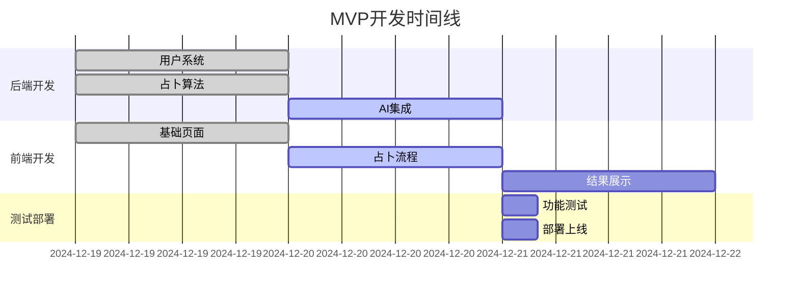

# 梅花心易占卜应用 - 产品路线图 (Roadmap)

## 1. 路线图概述

### 1.1 产品发展战略
梅花心易产品将采用快速迭代、小步快跑的发展策略，优先验证核心价值假设，然后逐步完善功能体验。

### 1.2 版本发布节奏
- **MVP版本**：3天快速验证核心功能
- **正式版本**：每2周一个迭代周期
- **重大版本**：每季度一次功能升级

## 2. 版本规划策略

### 2.1 MVP优先原则
- 核心功能优先：占卜算法 + AI解读
- 用户体验优先：简洁流畅的操作流程
- 技术稳定优先：确保基础功能可靠运行

### 2.2 迭代策略
- **数据驱动**：基于用户反馈和数据分析优化
- **快速验证**：小功能快速上线测试
- **用户共创**：邀请核心用户参与产品设计

## 3. 详细版本规划

### 3.1 MVP版本 (v0.1) - 3天开发周期
**发布目标**：验证核心价值假设，获得初始用户反馈

#### 核心功能
- ✅ 用户邮箱注册登录
- ✅ 基础用户资料录入
- ✅ 梅花易数占卜算法
- ✅ AI解读生成 (Claude API)
- ✅ 免费10次使用限制
- ✅ 基础结果展示页面

#### 技术实现
- 前端：Vue 3 + 基础UI组件
- 后端：Express + MongoDB基础CRUD
- 部署：Sealos DevBox单实例部署

#### 验收标准
- 完整占卜流程可用
- 用户注册登录正常
- AI解读生成成功率>90%
- 页面基本可用无重大bug

### 3.2 Beta版本 (v0.5) - 2周开发周期
**发布目标**：完善用户体验，增加核心商业功能

#### 新增功能
- 💰 支付系统集成 (微信支付)
- 📱 邀请好友奖励机制
- 📊 用户占卜历史记录
- 🎨 UI/UX优化升级
- 🔒 内容安全审核机制

#### 优化改进
- 占卜结果页面视觉升级
- 添加占卜过程动画效果
- 优化移动端适配
- 增加错误处理和用户提示

#### 验收标准
- 支付成功率>95%
- 邀请功能正常运行
- 移动端体验良好
- 内容审核机制有效

### 3.3 正式版本 (v1.0) - 4周开发周期
**发布目标**：产品正式上线，支持规模化运营

#### 新增功能
- 🎯 会员系统 (年费会员)
- 📤 社交分享功能
- 📈 用户数据统计面板
- 🛡️ 完整安全防护体系
- 📞 客服支持系统

#### 系统优化
- 性能优化 (支持1000并发)
- 数据库优化和备份策略
- 监控告警系统
- SEO优化

#### 验收标准
- 系统稳定性>99.5%
- 支持目标并发量
- 完整的运营数据统计
- 用户满意度>4.0

### 3.4 增强版本 (v1.5) - 6周开发周期
**发布目标**：功能丰富化，提升用户粘性

#### 新增功能
- 🎨 卦象可视化展示
- 📝 占卜日记功能
- 🏆 用户等级系统
- 🎁 每日签到奖励
- 📱 微信小程序版本

#### 体验优化
- AI解读个性化优化
- 占卜结果分享优化
- 用户引导流程优化
- 客服机器人集成

### 3.5 社区版本 (v2.0) - 8周开发周期
**发布目标**：构建用户社区，增强用户互动

#### 新增功能
- 👥 用户社区功能
- 💬 占卜结果评论互动
- 🏅 专家认证系统
- 📚 易学知识库
- 🎯 个性化推荐系统

## 4. 功能优先级矩阵

### 4.1 P0级功能 (必须有)
| 功能 | 版本 | 开发工时 | 依赖关系 |
|------|------|----------|----------|
| 用户注册登录 | MVP | 8小时 | 无 |
| 占卜核心算法 | MVP | 12小时 | 无 |
| AI解读生成 | MVP | 6小时 | Claude API |
| 基础UI界面 | MVP | 10小时 | 无 |
| 支付系统 | Beta | 16小时 | 第三方支付 |

### 4.2 P1级功能 (应该有)
| 功能 | 版本 | 开发工时 | 依赖关系 |
|------|------|----------|----------|
| 邀请奖励 | Beta | 12小时 | 用户系统 |
| 历史记录 | Beta | 8小时 | 数据库 |
| 分享功能 | v1.0 | 10小时 | 社交平台API |
| 会员系统 | v1.0 | 20小时 | 支付系统 |

### 4.3 P2级功能 (可以有)
| 功能 | 版本 | 开发工时 | 依赖关系 |
|------|------|----------|----------|
| 卦象可视化 | v1.5 | 24小时 | 图形库 |
| 社区功能 | v2.0 | 40小时 | 完整用户系统 |
| 小程序版本 | v1.5 | 32小时 | 微信开发者账号 |

## 5. 详细时间线计划

### 5.1 MVP阶段里程碑 (Day 1-3)

### 5.2 Beta版本里程碑 (Week 2-3)
- **Week 2**：支付系统开发和集成
- **Week 3**：邀请系统、历史记录、UI优化

### 5.3 正式版本里程碑 (Month 2)
- **Week 4-5**：会员系统、分享功能
- **Week 6-7**：性能优化、安全加固
- **Week 8**：测试和正式发布

## 6. 资源规划

### 6.1 人力资源配置
- **产品经理**：1人 (兼任项目管理)
- **前端开发**：1人 (Vue.js专家)
- **后端开发**：1人 (Node.js专家)
- **UI/UX设计**：1人 (兼任视觉设计)
- **测试工程师**：0.5人 (兼任运维)

### 6.2 技术资源需求
- **开发环境**：Sealos DevBox
- **第三方服务**：Claude API、支付接口、邮件服务
- **监控工具**：基础监控和日志系统

### 6.3 预算规划
- **开发成本**：主要为人力成本
- **运营成本**：服务器、API调用费用
- **营销成本**：初期以口碑传播为主

## 7. 风险管理

### 7.1 技术风险
| 风险 | 概率 | 影响 | 应对策略 |
|------|------|------|----------|
| Claude API不稳定 | 中 | 高 | 备用AI服务方案 |
| 并发性能问题 | 中 | 中 | 提前压力测试 |
| 数据安全问题 | 低 | 高 | 严格安全规范 |

### 7.2 业务风险
| 风险 | 概率 | 影响 | 应对策略 |
|------|------|------|----------|
| 用户接受度低 | 中 | 高 | 快速迭代优化 |
| 竞品抄袭 | 高 | 中 | 专注差异化优势 |
| 政策合规风险 | 低 | 高 | 严格内容审核 |

### 7.3 市场风险
| 风险 | 概率 | 影响 | 应对策略 |
|------|------|------|----------|
| 市场需求变化 | 中 | 中 | 灵活调整策略 |
| 获客成本高 | 中 | 中 | 优化推广渠道 |
| 付费转化低 | 中 | 高 | 优化产品价值 |

### 7.4 风险监控机制
- **每日监控**：技术指标、用户反馈
- **每周评估**：业务指标、风险状态
- **每月复盘**：整体风险评估和策略调整

## 8. 成功标准定义

### 8.1 MVP成功标准
- 完成核心功能开发
- 获得50个种子用户
- 占卜成功率>90%
- 用户反馈积极

### 8.2 Beta版本成功标准
- 支付功能正常运行
- 用户留存率>20%
- 付费转化率>5%
- 系统稳定运行

### 8.3 正式版本成功标准
- 月活用户1000+
- 付费转化率>15%
- 用户满意度>4.0
- 月收入1000元+

### 8.4 长期成功标准
- 年度用户1万+
- 年收入10万+
- 行业知名度建立
- 可持续盈利模式