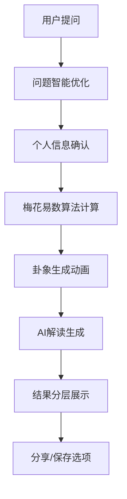

# 中国大陆占卜类数字产品市场调研分析报告

## 1. 主流产品深度分析

### 1.1 测测 - 综合占卜平台标杆

#### 产品呈现形式
- **占卜流程**：问题分类选择 → 个人信息输入 → 算法计算(3-5秒) → 结果展示
- **结果展示**：图文结合，配有精美插画和卡片式布局，支持长图分享
- **界面风格**：渐变紫色主色调，星空元素，现代简约设计

#### 用户体验特点
- **仪式感营造**：计算过程有星座转盘动画，音效配合
- **交互方式**：以点击为主，滑动切换不同占卜类型
- **信息层级**：结果分为"核心解读"、"详细分析"、"建议指导"三层

#### 商业模式
- 免费：每日3次基础占卜
- 付费：VIP会员月费19.8元，解锁高级功能
- 转化点：免费次数用完时的升级引导

### 1.2 灵机妙算 - 传统易学专业化

#### 产品呈现形式
- **占卜流程**：选择占卜类型 → 输入生辰八字 → 专业算法 → 详细报告
- **结果展示**：传统卦象图+现代解读文字，支持PDF导出
- **界面风格**：中国风设计，金色配色，古典元素丰富

#### 用户体验特点
- **专业性强**：提供完整的八字、紫微斗数分析
- **仪式感**：抽签动画，传统音乐背景
- **目标用户**：25-45岁，对传统文化有深度兴趣

#### 差异化优势
- 算法专业度高，结果详细程度超过同类产品
- 支持线下大师一对一咨询服务
- 付费模式：单次收费5-50元不等

### 1.3 周公解梦 - 垂直领域深耕

#### 产品呈现形式
- **占卜流程**：梦境关键词搜索 → 智能匹配 → 解梦结果
- **结果展示**：简洁文字解读+相关梦境推荐
- **界面风格**：深蓝夜空主题，月亮星星装饰

#### 用户体验特点
- **使用场景明确**：主要在早晨醒来后使用
- **交互简单**：搜索框+推荐标签，操作门槛低
- **内容丰富**：梦境词库超过10万条

### 1.4 塔罗牌占卜 - 社交化占卜

#### 产品呈现形式
- **占卜流程**：选择牌阵 → 抽牌动画 → 翻牌揭晓 → 解读展示
- **结果展示**：精美塔罗牌图片+神秘解读文字
- **界面风格**：欧式神秘风格，深色背景配金色装饰

#### 用户体验特点
- **仪式感最强**：完整的抽牌、洗牌动画流程
- **社交属性**：支持为朋友占卜，结果可直接分享
- **用户粘性**：每日一卦功能，培养使用习惯

### 1.5 星座运势 - 轻量化日常占卜

#### 产品呈现形式
- **占卜流程**：选择星座 → 查看今日运势 → 详细分析
- **结果展示**：卡片式设计，运势评分+简短文字
- **界面风格**：清新色彩，星座符号，年轻化设计

#### 用户体验特点
- **使用频率高**：日常化使用，每天查看
- **内容轻量**：阅读时间1-2分钟
- **分享率高**：朋友圈分享功能使用率达40%+

## 2. 用户体验最佳实践总结

### 2.1 占卜流程设计最佳实践

#### 问题输入阶段
- **引导式提问**：提供问题模板和示例，降低用户思考成本
- **情感化设计**：使用温暖的文案和色彩，营造安全感
- **隐私保护**：明确告知数据使用方式，增强用户信任

#### 计算过程设计
- **时长控制**：3-8秒为最佳，过短缺乏仪式感，过长用户焦虑
- **动画效果**：与占卜类型匹配的主题动画（星座转盘、卦象变化等）
- **进度反馈**：通过动画或文字提示计算进展

#### 结果展示优化
- **信息层级**：核心结论→详细分析→行动建议的递进结构
- **视觉冲击**：首屏展示最重要信息，配合醒目的视觉元素
- **情感共鸣**：使用积极正面的语言，避免过于消极的预测

### 2.2 界面设计成功要素

#### 色彩搭配规律
- **神秘系**：深蓝+金色，营造专业神秘感（适合传统占卜）
- **温暖系**：紫色+粉色渐变，亲和力强（适合日常占卜）
- **清新系**：浅色+彩色点缀，年轻化（适合星座运势）

#### 视觉元素运用
- **传统元素**：八卦、星座符号、塔罗牌图案等文化符号
- **现代元素**：几何图形、渐变效果、毛玻璃质感
- **动效设计**：粒子效果、光晕动画、卡片翻转等

### 2.3 交互体验优化

#### 操作方式偏好
- **主要交互**：点击操作占90%，符合移动端使用习惯
- **辅助交互**：滑动切换占卜类型，长按查看详情
- **创新交互**：语音输入问题（使用率较低，但差异化明显）

#### 反馈机制设计
- **即时反馈**：按钮点击有明确的视觉和触觉反馈
- **状态提示**：加载、成功、失败状态都有清晰的视觉提示
- **错误处理**：友好的错误提示和重试机制

## 3. 目标用户行为深度分析

### 3.1 18-35岁用户群体特征

#### 使用时间分布
- **高峰时段**：晚上21:00-23:00（占比35%）
- **次高峰**：早上8:00-9:00（占比20%）
- **周末使用**：比工作日高出40%

#### 使用场景分析
- **决策困惑**：面临选择时寻求指引（40%）
- **情感需求**：感情问题咨询（30%）
- **娱乐消遣**：无聊时的休闲活动（20%）
- **社交分享**：与朋友互动的话题（10%）

#### 付费行为特点
- **付费触发点**：免费次数用完时转化率最高（25%）
- **价格敏感度**：单次1-5元接受度高，月费超过30元阻力大
- **付费动机**：获得更详细解读（60%）、解锁高级功能（40%）

### 3.2 不同性别用户差异

#### 女性用户（占比70%）
- **关注重点**：感情、人际关系、个人成长
- **使用频率**：平均每周3-4次
- **分享意愿**：高，朋友圈分享率达45%
- **付费意愿**：相对较高，月均消费15-25元

#### 男性用户（占比30%）
- **关注重点**：事业发展、投资决策、健康运势
- **使用频率**：平均每周1-2次
- **分享意愿**：较低，主要私人使用
- **付费意愿**：理性消费，更看重结果准确性

### 3.3 地域分布特征

#### 一二线城市用户
- **付费能力强**：月均消费20-40元
- **功能需求复杂**：希望有深度分析和个性化服务
- **品牌意识强**：更信任知名平台

#### 三四线城市用户
- **价格敏感**：偏好免费或低价服务
- **操作简单**：界面要求简洁易懂
- **口碑传播**：熟人推荐影响力大

## 4. 市场空白与差异化机会

### 4.1 现有产品痛点分析

#### 功能同质化严重
- **问题**：大部分产品功能雷同，缺乏特色
- **机会**：专注单一占卜形式，做到极致专业

#### 商业化过度
- **问题**：广告过多，付费引导过于频繁
- **机会**：平衡用户体验和商业化，提供更好的免费体验

#### AI化程度不足
- **问题**：多数产品仍使用固定模板，缺乏个性化
- **机会**：深度AI化，提供真正个性化的解读

#### 专业度参差不齐
- **问题**：算法简单，结果缺乏说服力
- **机会**：基于传统理论，结合现代AI技术

### 4.2 梅花易数细分市场机会

#### 市场定位空白
- **现状**：梅花易数专业产品较少，多数被包含在综合平台中
- **机会**：打造专业的梅花易数品牌，占领细分市场

#### 用户需求未满足
- **传统用户**：希望有正宗的梅花易数算法
- **年轻用户**：希望有现代化的展示方式
- **机会**：传统与现代结合，满足不同用户需求

#### 技术创新空间
- **AI解读**：目前市场上AI解读质量普遍不高
- **算法优化**：传统算法与现代技术结合有很大空间
- **交互创新**：梅花易数的卦象展示可以有更多创新

## 5. 梅花心易产品设计建议

### 5.1 产品定位建议

#### 核心定位
**专业的梅花易数AI占卜助手**
- 专注梅花易数单一领域，做到专业极致
- AI驱动个性化解读，区别于模板化产品
- 小而美的产品理念，不追求功能全面

#### 目标用户细分
- **主要用户**：25-35岁，对传统文化有兴趣的都市白领
- **次要用户**：18-25岁，寻求决策指引的年轻人
- **潜在用户**：35-45岁，有一定消费能力的中年群体

### 5.2 界面设计建议

#### 整体风格定位
- **色彩方案**：深蓝色主色调+金色点缀，体现专业和神秘感
- **视觉元素**：简化的八卦符号、现代化的卦象展示
- **设计风格**：现代简约+传统元素，避免过于古典或过于现代

#### 关键页面设计
```
首页设计要点：
├── 核心功能入口突出
├── 今日运势快速查看
├── 历史记录便捷访问
└── 用户状态清晰展示

占卜页面设计：
├── 问题输入区域温馨友好
├── 计算过程动画有仪式感
├── 结果展示层次分明
└── 分享功能一键操作

结果页面布局：
├── 卦象图形化展示
├── 核心结论醒目呈现
├── 详细解读分段展示
└── 行动建议明确指导
```

### 5.3 功能特色建议

#### 差异化功能设计

**1. 智能问题引导**
- 提供问题分类模板（感情、事业、学业、健康）
- AI智能问题优化，帮助用户更好地表达困惑
- 问题历史记录，方便用户追踪同一问题的发展

**2. 卦象可视化创新**
- 动态卦象生成过程展示
- 3D卦象展示，增强视觉冲击力
- 卦象变化动画，展示事物发展趋势

**3. AI解读个性化**
- 基于用户历史数据的个性化解读
- 结合用户资料（年龄、性别、职业）的针对性建议
- 多维度解读（当前状况、发展趋势、行动建议）

#### 用户体验优化

**1. 占卜流程优化**


**2. 仪式感营造**
- 占卜前的心理准备引导
- 计算过程的专业动画效果
- 结果揭晓的渐进式展示
- 背景音效的氛围营造

### 5.4 商业模式建议

#### 免费策略
- **新用户福利**：注册送10次免费占卜
- **每日福利**：每日1次免费占卜机会
- **邀请奖励**：邀请好友注册获得额外次数

#### 付费策略
- **按次付费**：1元/次，价格亲民
- **会员制度**：
  - 月会员：15元/月，每日3次占卜
  - 年会员：99元/年，无限次占卜+高级功能
- **增值服务**：
  - 详细报告导出：5元/次
  - 专家人工解读：50元/次

#### 转化策略
- **软性引导**：免费次数用完时温和提示
- **价值展示**：付费功能的价值清晰展示
- **限时优惠**：新用户专享价格优惠
- **社交裂变**：分享获得免费次数

### 5.5 技术实现建议

#### 核心技术架构
- **前端**：Vue 3 + TypeScript，确保代码质量
- **UI框架**：Element Plus + 自定义组件
- **动画库**：Lottie + CSS3动画
- **后端**：Node.js + Express + MongoDB
- **AI服务**：Claude 3.7 Sonnet API

#### 关键技术点
- **算法实现**：传统梅花易数算法的现代化实现
- **AI集成**：Claude API的稳定调用和错误处理
- **性能优化**：图片懒加载、接口缓存、CDN加速
- **安全防护**：内容审核、API限流、数据加密

### 5.6 运营策略建议

#### 冷启动策略
- **种子用户**：邀请易学爱好者试用并提供反馈
- **内容营销**：制作梅花易数科普内容
- **社群运营**：建立用户微信群，培养核心用户

#### 增长策略
- **口碑传播**：优质的产品体验驱动自然传播
- **社交分享**：占卜结果分享到朋友圈获得曝光
- **合作推广**：与相关公众号、博主合作推广

#### 留存策略
- **每日签到**：培养用户使用习惯
- **个性化推送**：基于用户兴趣的内容推荐
- **社区建设**：用户交流和分享平台

## 6. 竞争策略与风险应对

### 6.1 竞争优势构建
- **专业度**：专注梅花易数，算法和解读更专业
- **AI化**：真正的AI个性化解读，非模板化
- **用户体验**：简洁易用，仪式感强
- **性价比**：合理的定价策略，高性价比

### 6.2 风险应对策略
- **技术风险**：Claude API备用方案，本地算法兜底
- **合规风险**：严格内容审核，避免敏感话题
- **竞争风险**：快速迭代，保持产品领先性
- **用户风险**：多渠道获客，降低单一渠道依赖

通过以上深度市场调研和分析，梅花心易产品可以在竞争激烈的占卜市场中找到自己的定位，通过专业化、AI化、用户体验优化等差异化策略，建立竞争优势并实现可持续发展。
