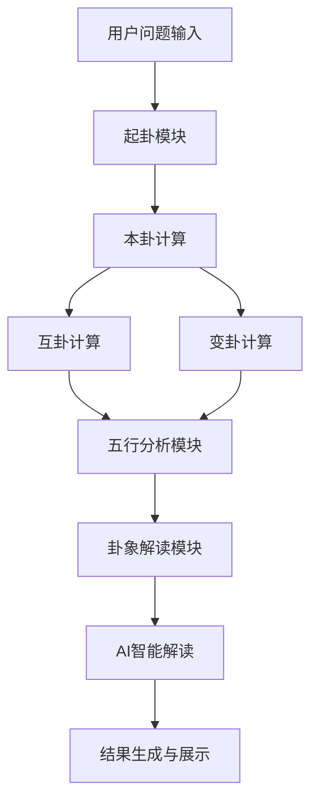
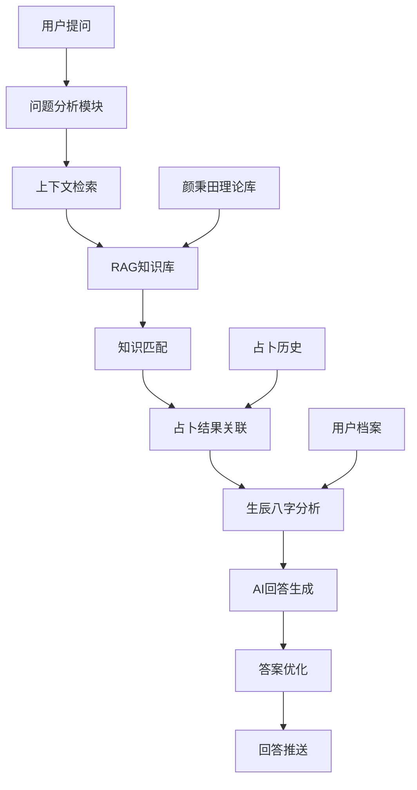
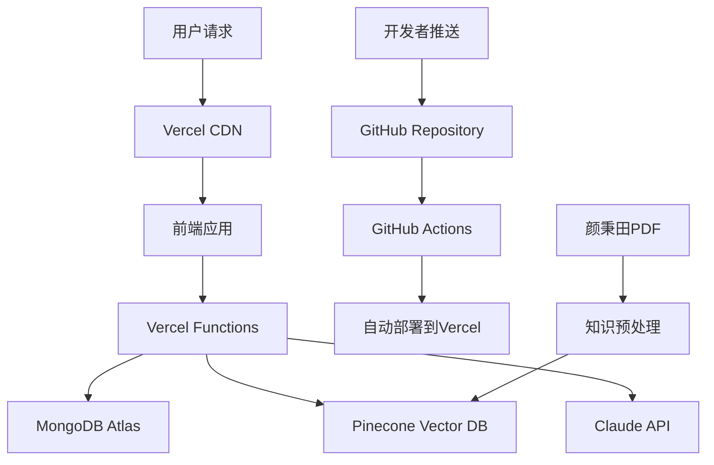

### 统一约定：八卦与爻的编码方案（后续算法与数据均遵循）

- **线的取值**
  - 长实线（阳爻）= 1
  - 断虚线（阴爻）= 0
- **八卦编码方案**
  •​乾​​：[1, 1, 1]（三阳爻）
  •​兑​​：[0, 1, 1]（上阴、中阳、下阳）
  •​离​​：[1, 0, 1]（上阳、中阴、下阳）
  •​震​​：[0, 0, 1]（上阴、中阴、下阳）
  •​巽​​：[1, 1, 0]（上阳、中阳、下阴）
  •​坎​​：[0, 1, 0]（上阴、中阳、下阴）
  •​艮​​：[1, 0, 0]（上阳、中阴、下阴）
  •坤​​：[0, 0, 0]（三阴爻）
 


# ！！！注意掷铜板时（0和1中是随机数选取时候），从数组的第六个数字（第5位）到第一个数字（第0位）依次写入占卜结果。

- **爻序与数组顺序**
  - 数组自下而上排列：第1位=初爻（最底），第6位=上爻（最顶）
  - 三爻卦（八卦）同理：第1位=下爻，第3位=上爻
  - 例：乾=[1,1,1]；坤=[0,0,0]

- **六十四卦拼装规则**
  - 六爻阵列 = 下卦三爻 + 上卦三爻
  - 例：下卦=震[1,0,0]，上卦=坎[0,1,0] → 六爻=[1,0,0,0,1,0]


# 梅花心易占卜算法及占卜实现规划及任务执行清单 v3.0

## 文档信息
- **版本**：v3.1 (算法核心已完成版)
- **日期**：2025年1月28日  
- **作者**：梅花心易项目团队
- **审核状态**：算法核心已完成，后端集成进行中
- **适用范围**：梅花心易占卜系统全栈开发
- **主要变更**：算法核心模块已完成，新增北京时间支持，更新进度状态

---

## 📊 当前项目进度总结 (2025年1月28日)

### ✅ **已完成的核心功能**

#### 🧮 **梅花心易算法核心** (100% 完成)
- ✅ **完整的八卦系统** (`src/algorithms/core/baguaSystem.js`)
- ✅ **五行分析系统** (`src/algorithms/core/fiveElementsSystem.js`)
- ✅ **占卜核心引擎** (`src/algorithms/core/meihuaDivinationCore.js`)
- ✅ **时间工具函数** (`src/algorithms/utils/timeUtils.js`) - 支持北京时间
- ✅ **数据模型完整** (`baguaData.js`, `hexagramData.js`)
- ✅ **输入验证器** (`divinationValidator.js`)
- ✅ **完整的测试套件** (35个测试，100%通过)

#### 🔧 **技术实现亮点**
- ✅ **精确的数组索引**：数组第n位代表第n爻
- ✅ **正确的随机填充**：从第6爻开始填充到第1爻
- ✅ **准确的互卦生成**：234345顺序（第2、3、4、3、4、5爻）
- ✅ **动态时间计算**：自动获取当前北京时间
- ✅ **完整的体用关系**：根据动爻位置确定体用
- ✅ **五行生克分析**：完整的五行关系计算

### 🔄 **当前进行中的工作**

#### 🔌 **后端API集成** (70% 完成)
- ✅ 基础架构和控制器
- ✅ 路由配置和中间件
- 🔄 **算法服务集成** - 需要将本地算法集成到后端服务
- 🔄 **数据库连接配置** - 需要配置MongoDB Atlas连接

### ⏳ **下一步行动计划**

#### 📅 **第一阶段：核心集成** (1-2周)
1. **算法服务集成** - 修改DivinationService直接调用本地算法
2. **数据库连接配置** - 配置MongoDB Atlas连接
3. **API接口完善** - 完善占卜API响应格式

#### 📅 **第二阶段：功能扩展** (2-3周)
1. **用户认证系统** - 实现邮箱验证码服务
2. **前后端集成** - 完善API文档和数据格式

#### 📅 **第三阶段：AI增强** (3-4周)
1. **AI智能解读** - 集成Claude API
2. **RAG知识库** - 构建向量数据库

---

## 1. 项目概述与背景分析

### 1.1 项目现状分析
基于对项目现有资料的深入分析，梅花心易项目具备以下基础：

**已完成的工作**：
- ✅ 完整的产品需求文档（PRD.md、PRD_MVP.md）
- ✅ 用户流程设计和交互原型（12个完整页面）
- ✅ 前端原型系统（Vue.js + 移动端优化）
- ✅ 基础技术架构设计（Node.js + Express + MongoDB）
- ✅ 模拟占卜结果生成（仅供演示）

**核心缺失部分**：
- ❌ **专业的梅花易数算法实现**
- ❌ 真实的起卦逻辑和卦象计算
- ❌ AI智能解读系统
- ❌ **AI占卜顾问问答功能** (新增)
- ❌ RAG知识库构建 (新增)
- ❌ 后端API服务实现
- ❌ 数据库设计和实现

### 1.2 项目目标与价值定位
**产品定位**：基于正宗梅花易数算法的AI智能占卜决策助手  
**核心价值**：专业算法 + AI解读 + 移动优先 + 高性价比  
**目标用户**：18-35岁年轻决策者，特别是一二线城市女性用户

---

## 2. 梅花易数算法深度分析

### 2.1 传统梅花易数核心理论

**历史渊源**：
- 创立者：北宋易学家邵雍（邵康节）
- 理论基础：先天八卦、五行生克、象数结合
- 特点：简便易学、随时起卦、准确率高

**算法核心原理**：
```
占卜流程 = 起卦 → 排卦 → 解卦 → AI增强解读
         ↓      ↓      ↓         ↓
       数字转换  卦象生成  五行分析   智能解读
```

### 2.2 先天八卦数字对应关系
```javascript
const BAGUA_NUMBERS = {
  1: { name: '乾', symbol: '☰', element: '金', nature: '天' ，number:1 },
  2: { name: '兑', symbol: '☱', element: '金', nature: '泽' ，number:2 },
  3: { name: '离', symbol: '☲', element: '火', nature: '火' ，number:3 },
  4: { name: '震', symbol: '☳', element: '木', nature: '雷' ，number:4 },
  5: { name: '巽', symbol: '☴', element: '木', nature: '风' ，number:5 },
  6: { name: '坎', symbol: '☵', element: '水', nature: '水' ，number:6 },
  7: { name: '艮', symbol: '☶', element: '土', nature: '山' ，number:7 },
  8: { name: '坤', symbol: '☷', element: '土', nature: '地' ，number:8 }
};
```

### 2.3 梅花心易核心算法流程（用户需求版本）

**起卦方式**：后台随机生成六个0或1的数字，长实线（阳爻）= 1，断虚线（阴爻）= 0

**完整占卜流程**：

#### 步骤①：生成主卦
```javascript
// 随机生成六个数字（0或1），从第6爻开始填充到第1爻
// 数组第n位代表第n爻（数组[0]是第1爻，数组[5]是第6爻）
function generatePrimaryHexagram() {
  const primaryGua = [];
  // 从第6爻开始填充到第1爻（数组索引5到0）
  for (let i = 5; i >= 0; i--) {
    primaryGua[i] = Math.floor(Math.random() * 2); // 0或1
  }
  return primaryGua; // [第1爻, 第2爻, 第3爻, 第4爻, 第5爻, 第6爻]
}

// 读取外卦（第6、5、4爻）和内卦（第3、2、1爻）
function analyzePrimaryGua(primaryGua) {
  const outerGua = [primaryGua[5], primaryGua[4], primaryGua[3]]; // 外卦（第6、5、4爻）
  const innerGua = [primaryGua[2], primaryGua[1], primaryGua[0]]; // 内卦（第3、2、1爻）
  
  const outerGuaNumber = getBaguaNumber(outerGua); // t_1
  const innerGuaNumber = getBaguaNumber(innerGua); // t_2
  
  return { outerGua, innerGua, outerGuaNumber, innerGuaNumber };
}
```

#### 步骤②：计算动爻
```javascript
// 根据时辰计算动爻：(主卦上卦数字t_1 + 下卦数字t_2 + 求卦时辰) / 6
function calculateMovingLine(outerGuaNumber, innerGuaNumber, hour) {
  const total = outerGuaNumber + innerGuaNumber + hour;
  const movingLine = (total % 6) || 6; // 动爻位置（1-6）
  return movingLine;
}

// 时辰对应表
const HOUR_TO_NUMBER = {
  23: 1, 0: 1, 1: 1,    // 子时
  2: 2, 3: 2,           // 丑时
  4: 3, 5: 3,           // 寅时
  6: 4, 7: 4,           // 卯时
  8: 5, 9: 5,           // 辰时
  10: 6, 11: 6,         // 巳时
  12: 7, 13: 7,         // 午时
  14: 8, 15: 8,         // 未时
  16: 9, 17: 9,         // 申时
  18: 10, 19: 10,       // 酉时
  20: 11, 21: 11,       // 戌时
  22: 12, 23: 12        // 亥时
};
```

#### 步骤③：生成变卦
```javascript
// 根据动爻n，将主卦数组第n个数字阴阳转换（0变1，1变0）
function generateBianGua(primaryGua, movingLine) {
  const bianGua = [...primaryGua];
  const index = movingLine - 1; // 转换为数组索引
  bianGua[index] = bianGua[index] === 1 ? 0 : 1; // 阴阳转换
  return bianGua;
}
```

#### 步骤④：生成互卦
```javascript
// 根据234345顺序取出互卦（第2、3、4、3、4、5爻）
function generateHuGua(primaryGua) {
  const huGua = [
    primaryGua[1], // 第2爻
    primaryGua[2], // 第3爻
    primaryGua[3], // 第4爻
    primaryGua[2], // 第3爻
    primaryGua[3], // 第4爻
    primaryGua[4]  // 第5爻
  ];
  return huGua;
}
```

#### 步骤⑤：确定体用关系
```javascript
// 根据动爻位置确定体用关系
function determineTiYong(movingLine, primaryGua) {
  const outerGua = [primaryGua[5], primaryGua[4], primaryGua[3]]; // 外卦（第6、5、4爻）
  const innerGua = [primaryGua[2], primaryGua[1], primaryGua[0]]; // 内卦（第3、2、1爻）
  
  let ti, yong;
  if (movingLine >= 1 && movingLine <= 3) {
    // 动爻在内卦，内卦为用，外卦为体
    ti = outerGua;
    yong = innerGua;
  } else {
    // 动爻在外卦，外卦为用，内卦为体
    ti = innerGua;
    yong = outerGua;
  }
  
  return { ti, yong };
}
```

#### 步骤⑥：五行分析
```javascript
// 根据体用关系分析五行生克
function analyzeFiveElements(ti, yong) {
  const tiElement = getBaguaElement(ti);
  const yongElement = getBaguaElement(yong);
  
  const relationship = getElementRelationship(tiElement, yongElement);
  
  return {
    tiElement,
    yongElement,
    relationship,
    fortune: calculateFortune(relationship)
  };
}
```

#### 步骤⑦：互卦解析
```javascript
// 互卦解析：根据主卦的体用关系确定互卦的解析顺序
function analyzeHuGua(huGua, primaryTiYong) {
  const outerHuGua = [huGua[5], huGua[4], huGua[3]]; // 互卦外卦（第6、5、4爻）
  const innerHuGua = [huGua[2], huGua[1], huGua[0]]; // 互卦内卦（第3、2、1爻）
  
  let tiHuGua, yongHuGua;
  if (primaryTiYong.tiIsOuter) {
    // 主卦体是外卦，互卦先读外卦再读内卦
    tiHuGua = outerHuGua;
    yongHuGua = innerHuGua;
  } else {
    // 主卦体是内卦，互卦先读内卦再读外卦
    tiHuGua = innerHuGua;
    yongHuGua = outerHuGua;
  }
  
  return {
    tiHuGua,
    yongHuGua,
    tiNature: getBaguaNature(tiHuGua),
    yongNature: getBaguaNature(yongHuGua)
  };
}
```

---

## 3. 核心算法架构设计

### 3.1 系统架构概览



### 3.2 核心模块设计

#### 3.2.1 起卦核心模块（DivinationCore）
```javascript
class MeihuaDivinationCore {
  constructor() {
    this.baguaSystem = new BaguaSystem();
    this.fiveElements = new FiveElementsSystem();
    this.hexagramDatabase = new HexagramDatabase();
  }

  // 主要起卦方法
  async performDivination(question, method = 'time', params = {}) {
    // 1. 验证输入
    this.validateInput(question, method, params);
    
    // 2. 起卦计算
    const primaryResult = this.calculatePrimaryGua(method, params);
    
    // 3. 生成三卦
    const benGua = this.createHexagram(primaryResult.upperGua, primaryResult.lowerGua);
    const huGua = this.calculateHuGua(benGua);
    const bianGua = this.calculateBianGua(benGua, primaryResult.movingLine);
    
    // 4. 五行分析
    const wuxingAnalysis = this.analyzeFiveElements(benGua, huGua, bianGua);
    
    // 5. 基础解读
    const basicInterpretation = this.getBasicInterpretation(benGua, huGua, bianGua, wuxingAnalysis);
    
    return {
      question,
      timestamp: new Date(),
      benGua,      // 本卦
      huGua,       // 互卦  
      bianGua,     // 变卦
      movingLine: primaryResult.movingLine,
      wuxingAnalysis,
      basicInterpretation
    };
  }
}
```

#### 3.2.2 八卦系统模块（BaguaSystem）
```javascript
class BaguaSystem {
  constructor() {
    this.initializeBaguaData();
  }

  // 获取八卦属性
  getBaguaProperties(number) {
    return {
      number: number,
      name: this.BAGUA_NAMES[number],
      symbol: this.BAGUA_SYMBOLS[number],
      element: this.BAGUA_ELEMENTS[number],
      nature: this.BAGUA_NATURES[number],
      direction: this.BAGUA_DIRECTIONS[number],
      attributes: this.BAGUA_ATTRIBUTES[number]
    };
  }

  // 创建六十四卦
  createHexagram(upperGua, lowerGua) {
    const hexagramNumber = this.getHexagramNumber(upperGua, lowerGua);
    return {
      id: hexagramNumber,
      name: this.getHexagramName(hexagramNumber),
      upperGua: this.getBaguaProperties(upperGua),
      lowerGua: this.getBaguaProperties(lowerGua),
      lines: this.generateHexagramLines(upperGua, lowerGua),
      traditional: this.getTraditionalMeaning(hexagramNumber)
    };
  }
}
```

#### 3.2.3 五行分析模块（FiveElementsSystem）
```javascript
class FiveElementsSystem {
  constructor() {
    this.elements = ['金', '木', '水', '火', '土'];
    this.relations = this.initializeRelations();
  }

  // 分析五行关系
  analyzeFiveElements(benGua, huGua, bianGua) {
    const benElement = this.getHexagramElement(benGua);
    const huElement = this.getHexagramElement(huGua);
    const bianElement = this.getHexagramElement(bianGua);

    return {
      ben: benElement,
      hu: huElement,
      bian: bianElement,
      relationships: {
        benToHu: this.getRelationship(benElement, huElement),
        benToBian: this.getRelationship(benElement, bianElement),
        huToBian: this.getRelationship(huElement, bianElement)
      },
      fortune: this.calculateFortune(benElement, huElement, bianElement)
    };
  }

  // 五行生克关系判断
  getRelationship(element1, element2) {
    if (this.relations.generation[element1] === element2) {
      return { type: 'generation', strength: 'strong', meaning: '生' };
    } else if (this.relations.destruction[element1] === element2) {
      return { type: 'destruction', strength: 'strong', meaning: '克' };
    } else if (element1 === element2) {
      return { type: 'same', strength: 'neutral', meaning: '同' };
    } else {
      return { type: 'neutral', strength: 'weak', meaning: '平' };
    }
  }
}
```

#### 3.2.4 卦象计算模块
```javascript
class HexagramCalculation {
  // 计算互卦
  calculateHuGua(hexagram) {
    const lines = hexagram.lines;
    // 取2、3、4爻为上卦，3、4、5爻为下卦
    const upperLines = [lines[1], lines[2], lines[3]];
    const lowerLines = [lines[2], lines[3], lines[4]];
    
    const upperGua = this.linesToGua(upperLines);
    const lowerGua = this.linesToGua(lowerLines);
    
    return this.baguaSystem.createHexagram(upperGua, lowerGua);
  }

  // 计算变卦
  calculateBianGua(hexagram, movingLine) {
    const lines = [...hexagram.lines];
    // 动爻变化：阳变阴，阴变阳
    lines[movingLine - 1] = lines[movingLine - 1] === 1 ? 0 : 1;
    
    const upperLines = lines.slice(3, 6);
    const lowerLines = lines.slice(0, 3);
    
    const upperGua = this.linesToGua(upperLines);
    const lowerGua = this.linesToGua(lowerLines);
    
    return this.baguaSystem.createHexagram(upperGua, lowerGua);
  }
}
```

---

## 4. AI智能解读系统设计

### 4.1 AI解读架构
```javascript
class AIInterpretationSystem {
  constructor() {
    this.claudeAPI = new ClaudeAPI();
    this.promptTemplate = new PromptTemplateManager();
    this.contextAnalyzer = new ContextAnalyzer();
  }

  async generateInterpretation(divinationResult, userContext) {
    // 1. 分析用户问题类型
    const questionType = this.contextAnalyzer.analyzeQuestionType(divinationResult.question);
    
    // 2. 构建提示词模板
    const prompt = this.promptTemplate.buildPrompt({
      question: divinationResult.question,
      questionType: questionType,
      benGua: divinationResult.benGua,
      huGua: divinationResult.huGua,
      bianGua: divinationResult.bianGua,
      wuxingAnalysis: divinationResult.wuxingAnalysis,
      userProfile: userContext
    });

    // 3. 调用AI生成解读
    const aiResponse = await this.claudeAPI.generateResponse(prompt);
    
    // 4. 后处理和格式化
    return this.formatInterpretation(aiResponse, divinationResult);
  }
}
```

### 4.2 提示词模板设计
```javascript
const INTERPRETATION_PROMPT_TEMPLATE = `
你是一位精通梅花易数的专业占卜师，请基于以下卦象信息为用户提供专业解读：

**用户问题**：{{question}}
**问题类型**：{{questionType}}

**卦象信息**：
- 本卦：{{benGua.name}}（{{benGua.upperGua.name}}{{benGua.lowerGua.name}}）
- 互卦：{{huGua.name}}（{{huGua.upperGua.name}}{{huGua.lowerGua.name}}）
- 变卦：{{bianGua.name}}（{{bianGua.upperGua.name}}{{bianGua.lowerGua.name}}）
- 动爻：第{{movingLine}}爻

**五行分析**：
- 本卦五行：{{wuxingAnalysis.ben}}
- 互卦五行：{{wuxingAnalysis.hu}}
- 变卦五行：{{wuxingAnalysis.bian}}
- 五行关系：{{wuxingAnalysis.relationships}}

请提供：
1. 卦象总体含义（100-150字）
2. 针对具体问题的分析（150-200字）
3. 建议和指导（100字）
4. 时机把握（50字）

要求：语言亲和、积极正面、具有指导意义，避免过于玄虚或消极。
`;
```

---

## 5. AI占卜顾问问答系统设计 (新增功能)

### 5.1 功能概述与价值
**功能描述**：基于用户的占卜结果和生辰八字，提供智能对话式的占卜咨询服务。用户可以针对占卜结果提出具体问题，AI顾问将结合梅花心易理论和个人信息给出专业解答。

**核心价值**：
- **深度互动**：从单向解读升级为双向对话
- **个性化服务**：结合生辰八字的针对性建议
- **专业指导**：基于颜秉田梅花心易理论的权威解答
- **用户体验提升**：增加产品粘性和使用深度

### 5.2 系统架构设计



### 5.3 核心模块实现

#### 5.3.1 AI占卜顾问核心类
```javascript
class AIConsultantSystem {
  constructor() {
    this.pineconeClient = new PineconeClient();
    this.claudeAPI = new ClaudeAPI();
    this.contextManager = new ContextManager();
    this.userProfileAnalyzer = new UserProfileAnalyzer();
    this.knowledgeRetriever = new KnowledgeRetriever();
  }

  /**
   * 处理用户问答请求
   * @param {string} question - 用户问题
   * @param {string} divinationId - 相关占卜ID
   * @param {Object} userProfile - 用户档案（包含生辰八字）
   * @returns {Object} AI顾问回答
   */
  async answerQuestion(question, divinationId, userProfile) {
    try {
      // 1. 获取占卜上下文
      const divinationContext = await this.getDivinationContext(divinationId);

      // 2. 分析用户问题类型
      const questionAnalysis = this.analyzeQuestion(question);

      // 3. 检索相关知识
      const relevantKnowledge = await this.retrieveRelevantKnowledge(
        question,
        divinationContext,
        questionAnalysis.category
      );

      // 4. 分析生辰八字影响
      const bazi_analysis = this.userProfileAnalyzer.analyzeBaziInfluence(
        userProfile.birthInfo,
        divinationContext.hexagrams
      );

      // 5. 构建提示词
      const prompt = this.buildConsultantPrompt({
        question,
        divinationContext,
        relevantKnowledge,
        userProfile,
        baziAnalysis: bazi_analysis,
        questionType: questionAnalysis.category
      });

      // 6. 生成AI回答
      const aiResponse = await this.claudeAPI.generateResponse(prompt);

      // 7. 后处理和优化
      const optimizedAnswer = this.optimizeAnswer(aiResponse, questionAnalysis);

      // 8. 保存对话记录
      await this.saveConversation(divinationId, question, optimizedAnswer);

      return {
        answer: optimizedAnswer,
        relatedKnowledge: relevantKnowledge.sources,
        confidence: optimizedAnswer.confidence,
        followUpSuggestions: this.generateFollowUpSuggestions(questionAnalysis)
      };

    } catch (error) {
      throw new Error(`AI顾问回答生成失败: ${error.message}`);
    }
  }
}
```

#### 5.3.2 RAG知识检索系统
```javascript
class KnowledgeRetriever {
  constructor() {
    this.pinecone = new PineconeClient();
    this.embeddings = new OpenAIEmbeddings();
  }

  /**
   * 检索相关知识
   * @param {string} query - 查询问题
   * @param {Object} context - 占卜上下文
   * @param {string} category - 问题分类
   * @returns {Array} 相关知识条目
   */
  async retrieveRelevantKnowledge(query, context, category) {
    // 1. 生成查询向量
    const queryEmbedding = await this.embeddings.embed(query);

    // 2. 构建查询过滤器
    const filters = this.buildSearchFilters(context, category);

    // 3. 向量相似度搜索
    const searchResults = await this.pinecone.query({
      vector: queryEmbedding,
      filter: filters,
      topK: 10,
      includeMetadata: true
    });

    // 4. 结果排序和过滤
    const rankedResults = this.rankSearchResults(searchResults, context);

    return {
      knowledge: rankedResults.slice(0, 5),
      sources: rankedResults.map(r => r.metadata.source),
      confidence: rankedResults[0]?.score || 0
    };
  }

  buildSearchFilters(context, category) {
    return {
      category: { $in: [category, "general"] },
      hexagram_id: { $in: [
        context.hexagrams.ben.id,
        context.hexagrams.hu.id,
        context.hexagrams.bian.id
      ] },
      element: { $in: [
        context.analysis.wuxing.ben,
        context.analysis.wuxing.hu,
        context.analysis.wuxing.bian
      ] }
    };
  }
}
```

#### 5.3.3 生辰八字分析模块
```javascript
class UserProfileAnalyzer {
  constructor() {
    this.baziCalculator = new BaziCalculator();
    this.elementAnalyzer = new FiveElementsAnalyzer();
  }

  /**
   * 分析生辰八字对占卜结果的影响
   * @param {Object} birthInfo - 出生信息
   * @param {Object} hexagrams - 卦象信息
   * @returns {Object} 八字分析结果
   */
  analyzeBaziInfluence(birthInfo, hexagrams) {
    // 1. 计算生辰八字
    const bazi = this.baziCalculator.calculate(birthInfo);

    // 2. 分析本命五行
    const nativeElements = this.elementAnalyzer.analyzeNativeFiveElements(bazi);

    // 3. 计算与卦象的五行相互关系
    const elementInteraction = this.analyzeElementInteraction(
      nativeElements,
      hexagrams
    );

    // 4. 分析时运影响
    const currentLuck = this.analyzeCurrentLuck(bazi, new Date());

    return {
      bazi: bazi,
      nativeElements: nativeElements,
      elementInteraction: elementInteraction,
      currentLuck: currentLuck,
      compatibilityScore: this.calculateCompatibility(nativeElements, hexagrams),
      recommendations: this.generateBaziRecommendations(elementInteraction, currentLuck)
    };
  }

  analyzeElementInteraction(nativeElements, hexagrams) {
    const interactions = {};

    ['ben', 'hu', 'bian'].forEach(type => {
      const hexagramElement = hexagrams[type].element;
      interactions[type] = {
        relationship: this.getElementRelationship(nativeElements.primary, hexagramElement),
        strength: this.calculateInteractionStrength(nativeElements, hexagramElement),
        influence: this.determineInfluence(nativeElements.primary, hexagramElement)
      };
    });

    return interactions;
  }
}
```

### 5.4 知识库构建策略

#### 5.4.1 知识来源与分类
```javascript
const KNOWLEDGE_CATEGORIES = {
  THEORY: {
    name: "梅花心易理论",
    sources: ["颜秉田梅花心易-正式20231103v3.pdf"],
    subcategories: ["基础理论", "卦象解读", "五行生克", "时间应验"]
  },
  HEXAGRAM: {
    name: "卦象解释",
    sources: ["六十四卦详解", "卦辞象辞"],
    subcategories: ["本卦含义", "变卦解读", "互卦分析", "动爻解释"]
  },
  BAZI: {
    name: "生辰八字",
    sources: ["八字命理学", "五行相配"],
    subcategories: ["四柱分析", "十神关系", "大运流年", "五行喜忌"]
  },
  APPLICATION: {
    name: "实际应用",
    sources: ["案例分析", "问题解答"],
    subcategories: ["感情婚姻", "事业财运", "健康疾病", "学业考试"]
  }
};
```

#### 5.4.2 知识向量化处理
```javascript
class KnowledgeIndexer {
  constructor() {
    this.pinecone = new PineconeClient();
    this.embeddings = new OpenAIEmbeddings();
  }

  /**
   * 处理颜秉田理论文档
   * @param {string} pdfPath - PDF文件路径
   */
  async processYanBingTianTheory(pdfPath) {
    // 1. PDF解析和文本提取
    const textChunks = await this.extractTextChunks(pdfPath);

    // 2. 智能分块处理
    const processedChunks = await this.intelligentChunking(textChunks);

    // 3. 生成向量嵌入
    const embeddings = await this.generateEmbeddings(processedChunks);

    // 4. 存储到Pinecone
    await this.storeInPinecone(embeddings, {
      source: "颜秉田梅花心易理论",
      category: "THEORY",
      priority: "high"
    });
  }

  async intelligentChunking(textChunks) {
    const chunks = [];

    for (const chunk of textChunks) {
      // 识别章节结构
      const sections = this.identifySections(chunk);

      // 按语义单元分块
      const semanticChunks = await this.semanticChunking(sections);

      // 添加元数据
      chunks.push(...semanticChunks.map(sc => ({
        content: sc.text,
        metadata: {
          section: sc.section,
          keywords: this.extractKeywords(sc.text),
          hexagrams: this.identifyHexagrams(sc.text),
          elements: this.identifyElements(sc.text)
        }
      })));
    }

    return chunks;
  }
}
```

### 5.5 API接口设计

#### 5.5.1 顾问问答接口
```typescript
// POST /api/v1/consultant/ask
interface ConsultantRequest {
  question: string;                    // 用户问题
  divinationId: string;               // 关联的占卜ID
  conversationId?: string;            // 对话会话ID（可选）
  questionType?: string;              // 问题类型
  context?: {                         // 额外上下文
    focusArea?: string;               // 关注领域：感情/事业/健康等
    timeFrame?: string;               // 时间范围：近期/长期
    specificConcern?: string;         // 具体关切点
  };
}

interface ConsultantResponse {
  success: boolean;
  data: {
    conversationId: string;           // 对话会话ID
    answer: {
      content: string;                // 回答内容
      confidence: number;             // 置信度 (0-1)
      reasoning: string;              // 推理过程
      keyPoints: string[];            // 关键要点
    };
    relatedKnowledge: {               // 相关知识来源
      sources: string[];              // 知识来源
      quotes: string[];               // 相关引用
    };
    baziInsights?: {                  // 八字洞察（如有）
      influence: string;              // 八字影响
      compatibility: number;          // 相容性评分
      recommendations: string[];      // 建议
    };
    followUp: {                       // 后续建议
      suggestedQuestions: string[];   // 建议追问
      relatedTopics: string[];        // 相关话题
    };
    metadata: {
      processingTime: number;         // 处理时间
      knowledgeCount: number;         // 使用知识条目数
      timestamp: string;              // 时间戳
    };
  };
  message?: string;
}
```

#### 5.5.2 对话历史接口
```typescript
// GET /api/v1/consultant/conversations/:divinationId
interface ConversationHistory {
  divinationId: string;
  conversations: Array<{
    id: string;
    question: string;
    answer: string;
    timestamp: string;
    satisfaction?: number;            // 用户满意度评分
  }>;
  summary: {
    totalQuestions: number;
    averageSatisfaction: number;
    mainTopics: string[];
  };
}
```

### 5.6 用户体验设计

#### 5.6.1 对话界面设计
```javascript
// 前端对话组件设计
class ConsultantChat {
  constructor() {
    this.messageHistory = [];
    this.isTyping = false;
    this.currentDivination = null;
  }

  async sendQuestion(question) {
    // 1. 显示用户问题
    this.addMessage('user', question);

    // 2. 显示AI思考状态
    this.showTypingIndicator();

    // 3. 发送API请求
    const response = await this.consultantAPI.ask({
      question: question,
      divinationId: this.currentDivination.id,
      conversationId: this.conversationId
    });

    // 4. 隐藏思考状态
    this.hideTypingIndicator();

    // 5. 逐字显示AI回答
    await this.typewriterEffect(response.data.answer.content);

    // 6. 显示相关建议
    this.showFollowUpSuggestions(response.data.followUp.suggestedQuestions);
  }

  async typewriterEffect(text) {
    const messageElement = this.addMessage('assistant', '');
    const words = text.split('');

    for (let i = 0; i < words.length; i++) {
      messageElement.textContent += words[i];
      await this.delay(30); // 30ms延迟
    }
  }
}
```

#### 5.6.2 智能问题建议
```javascript
class QuestionSuggestionEngine {
  constructor() {
    this.suggestionTemplates = this.loadSuggestionTemplates();
  }

  /**
   * 基于占卜结果生成建议问题
   * @param {Object} divinationResult - 占卜结果
   * @param {Object} userProfile - 用户档案
   * @returns {Array} 建议问题列表
   */
  generateSuggestions(divinationResult, userProfile) {
    const suggestions = [];

    // 1. 基于卦象特点的问题
    const hexagramSuggestions = this.getHexagramBasedSuggestions(
      divinationResult.hexagrams
    );

    // 2. 基于五行分析的问题
    const elementSuggestions = this.getElementBasedSuggestions(
      divinationResult.analysis.wuxing
    );

    // 3. 基于问题类型的深度问题
    const deepSuggestions = this.getDeepDiveSuggestions(
      divinationResult.question
    );

    // 4. 基于用户历史的个性化问题
    const personalizedSuggestions = this.getPersonalizedSuggestions(
      userProfile.questionHistory
    );

    return [
      ...hexagramSuggestions.slice(0, 2),
      ...elementSuggestions.slice(0, 2),
      ...deepSuggestions.slice(0, 1),
      ...personalizedSuggestions.slice(0, 1)
    ];
  }
}
```

---

## 6. 技术实现规划 (更新技术栈)

### 6.1 技术栈优化与部署架构

#### 6.1.1 云原生技术栈配置
基于需求二的技术栈要求，采用以下现代化云原生架构：

**版本控制与协作**：
- **GitHub** - 代码托管与版本管理
- **GitHub Actions** - CI/CD自动化部署
- **GitHub Issues** - 需求管理与Bug追踪

**前端部署**：
- **Vercel** - 无服务器前端部署平台
- **自动部署** - Git推送触发自动构建部署
- **CDN加速** - 全球内容分发网络
- **域名管理** - 自定义域名配置

**后端服务**：
- **Vercel Serverless Functions** - 无服务器API端点
- **Edge Runtime** - 边缘计算运行时
- **自动扩缩容** - 按需资源分配

**数据库服务**：
- **MongoDB Atlas** - 云原生NoSQL数据库
- **自动备份** - 数据安全保障
- **全球分布** - 就近数据存取
- **实时监控** - 性能指标追踪

**RAG知识库**：
- **Pinecone** - 向量数据库服务
- **语义搜索** - 高精度知识检索
- **实时索引** - 动态知识更新
- **多租户架构** - 数据隔离

#### 6.1.2 部署架构图


#### 6.1.3 环境配置管理
```javascript
// vercel.json 配置文件
{
  "functions": {
    "api/divination/perform.js": {
      "maxDuration": 30
    },
    "api/consultant/ask.js": {
      "maxDuration": 60
    }
  },
  "env": {
    "MONGODB_URI": "@mongodb_atlas_uri",
    "PINECONE_API_KEY": "@pinecone_api_key",
    "CLAUDE_API_KEY": "@claude_api_key"
  },
  "regions": ["hkg1", "tpe1"],
  "rewrites": [
    {
      "source": "/api/(.*)",
      "destination": "/api/$1"
    }
  ]
}
```

### 6.2 API接口设计 (更新)

#### 6.2.1 占卜核心接口
```typescript
// POST /api/v1/divination/perform
interface DivinationRequest {
  question: string;          // 占卜问题
  questionType?: string;     // 问题类型：感情/事业/学业/健康等
  method: 'time' | 'number'; // 起卦方法
  parameters?: {             // 起卦参数
    time?: {
      year: number;
      month: number;
      day: number;
      hour: number;
    };
    numbers?: {
      number1: number;
      number2: number;
    };
  };
  userContext?: {            // 用户背景信息
    gender?: string;
    age?: number;
    location?: string;
  };
}

interface DivinationResponse {
  success: boolean;
  data: {
    id: string;              // 占卜记录ID
    question: string;
    timestamp: string;
    hexagrams: {
      ben: Hexagram;         // 本卦
      hu: Hexagram;          // 互卦
      bian: Hexagram;        // 变卦
    };
    movingLine: number;      // 动爻
    analysis: {
      wuxing: FiveElementAnalysis;
      traditional: string;   // 传统解读
      ai: string;           // AI智能解读
    };
    advice: {
      timing: string;        // 时机建议
      action: string;        // 行动建议
      precaution: string;    // 注意事项
    };
  };
  message?: string;
}
```

#### 6.2.2 AI占卜顾问接口 (新增)
```typescript
// POST /api/v1/consultant/ask - AI顾问问答
// GET /api/v1/consultant/conversations/:divinationId - 对话历史
// POST /api/v1/consultant/feedback - 顾问服务反馈
// GET /api/v1/consultant/suggestions/:divinationId - 智能问题建议
```

#### 6.2.3 辅助接口设计
```typescript
// GET /api/v1/hexagram/:id - 获取卦象详情
// GET /api/v1/divination/history - 获取历史记录
// POST /api/v1/divination/feedback - 用户反馈
// GET /api/v1/system/daily-fortune - 每日运势
```

### 6.3 数据库设计 (优化)

#### 6.3.1 核心数据模型 (MongoDB Atlas)
```javascript
// 占卜记录表
const DivinationSchema = {
  _id: ObjectId,
  userId: ObjectId,
  question: String,
  questionType: String,
  method: String,
  parameters: Object,

  // 卦象信息
  hexagrams: {
    ben: {
      id: Number,
      name: String,
      upperGua: Object,
      lowerGua: Object,
      lines: Array
    },
    hu: Object,
    bian: Object
  },

  movingLine: Number,

  // 分析结果
  analysis: {
    wuxing: Object,
    traditional: String,
    ai: String,
    confidence: Number
  },

  // 元数据
  timestamp: Date,
  aiModel: String,
  processingTime: Number,
  userFeedback: {
    rating: Number,
    comment: String,
    helpful: Boolean
  },

  createdAt: Date,
  updatedAt: Date
};

// 卦象数据库表
const HexagramSchema = {
  _id: Number,           // 1-64
  name: String,          // 卦名
  upperGua: Number,      // 上卦编号
  lowerGua: Number,      // 下卦编号

  traditional: {
    judgment: String,     // 卦辞
    commentary: String,   // 彖辞
    image: String,       // 象辞
    lines: Array         // 六爻爻辞
  },

  modern: {
    keywords: Array,     // 关键词
    fortune: String,     // 吉凶
    advice: String,      // 建议
    timing: String       // 时机
  },

  wuxing: {
    primary: String,     // 主要五行
    secondary: String    // 次要五行
  }
};

// AI顾问对话记录表 (新增)
const ConsultantConversationSchema = {
  _id: ObjectId,
  conversationId: String,      // 对话会话ID
  divinationId: ObjectId,      // 关联占卜记录
  userId: ObjectId,            // 用户ID

  // 对话内容
  messages: [{
    id: String,
    type: String,              // 'user' | 'assistant'
    content: String,           // 消息内容
    timestamp: Date,
    metadata: {
      confidence: Number,      // AI回答置信度
      processingTime: Number,  // 处理时间
      knowledgeUsed: Array,    // 使用的知识条目ID
      reasoning: String        // 推理过程
    }
  }],

  // 对话统计
  stats: {
    totalMessages: Number,
    userSatisfaction: Number,  // 用户满意度评分
    averageResponseTime: Number,
    mainTopics: Array          // 主要讨论话题
  },

  // 上下文信息
  context: {
    baziAnalysis: Object,      // 生辰八字分析结果
    userPreferences: Object,   // 用户偏好
    sessionDuration: Number    // 会话持续时间
  },

  status: String,              // 'active' | 'closed' | 'archived'
  createdAt: Date,
  updatedAt: Date
};
```

---

## 7. 开发任务执行清单 (更新版本)

### 7.1 开发阶段划分 (新增AI顾问功能)

**Phase 1: 核心算法实现（预计15-20天）** ✅ **已完成**
- [x] 梅花易数核心算法开发 ✅ **已完成**
- [x] 八卦系统实现 ✅ **已完成**
- [x] 五行分析模块 ✅ **已完成**
- [x] 时间工具函数（北京时间支持）✅ **已完成**
- [x] 单元测试覆盖 ✅ **已完成**
- [ ] 生辰八字计算模块 (新增) 🔄 **进行中**

**Phase 2: RAG知识库建设（预计12-15天）** (新增Phase)
- [ ] 颜秉田理论文档处理
- [ ] Pinecone向量数据库配置
- [ ] 知识分块与向量化
- [ ] 知识检索系统实现
- [ ] 知识库质量验证

**Phase 3: API服务开发（预计12-15天）**
- [ ] Vercel Serverless函数搭建
- [ ] 占卜接口实现
- [ ] AI顾问问答接口 (新增)
- [ ] MongoDB Atlas数据库设计
- [ ] 接口测试

**Phase 4: AI智能解读与顾问（预计15-18天）** (扩展)
- [ ] AI基础解读系统
- [ ] AI顾问对话系统 (新增)
- [ ] 上下文管理模块 (新增)
- [ ] 生辰八字关联分析 (新增)
- [ ] Claude API集成优化
- [ ] 问题建议引擎 (新增)
- [ ] 对话体验优化 (新增)

**Phase 5: 系统集成与部署（预计10-12天）** (更新)
- [ ] 前后端集成
- [ ] Vercel自动部署配置
- [ ] GitHub Actions CI/CD
- [ ] 性能优化
- [ ] 错误处理完善
- [ ] 系统测试

### 7.2 里程碑与关键节点 (更新)

**M1: 算法核心完成（Day 24）** ✅ **已完成**
- ✅ 梅花易数算法实现 ✅ **已完成**
- ✅ 时间工具函数（北京时间支持）✅ **已完成**
- ✅ 基础占卜功能可用 ✅ **已完成**
- ✅ 核心测试通过 ✅ **已完成**
- [ ] 生辰八字计算模块 (新增) 🔄 **进行中**
- **实际完成时间**：提前完成（原预计24天，实际约15天）

**M2: RAG知识库就绪（Day 39）** (新增里程碑)
- ✅ 颜秉田理论文档处理完成
- ✅ Pinecone向量数据库配置完成
- ✅ 知识检索系统可用
- ✅ 知识库质量验证通过
- **预计工时**：15天

**M3: API服务就绪（Day 54）** (更新)
- ✅ Vercel Serverless函数部署
- ✅ 占卜API接口可用
- ✅ AI顾问问答接口可用 (新增)
- ✅ MongoDB Atlas数据库稳定运行
- ✅ 所有API接口测试通过
- **预计工时**：15天（原15天，功能扩展）

**M4: AI解读与顾问集成（Day 72）** (扩展)
- ✅ Claude API集成完成
- ✅ 基础智能解读质量达标
- ✅ AI顾问对话系统可用 (新增)
- ✅ 生辰八字关联分析可用 (新增)
- ✅ 问题建议引擎可用 (新增)
- ✅ 解读性能满足要求
- **预计工时**：18天（原12天 + 6天新增功能）

**M5: 系统上线就绪（Day 84）** (更新)
- ✅ 前后端完整集成
- ✅ AI顾问界面集成完成 (新增)
- ✅ Vercel自动部署配置完成 (新增)
- ✅ 系统性能达标
- ✅ 用户体验满意
- **预计工时**：12天（原10天 + 2天新增功能）

**总开发周期：84个工作日（约17周）**
- 原计划：55天
- 新增功能增加：29天
- 主要增加：RAG知识库建设、AI顾问功能、生辰八字集成

### 7.3 风险评估与应对策略 (更新)

**高风险项**：
1. **AI顾问对话质量** (新增高风险)
   - 风险：AI顾问回答不够专业或相关性差
   - 影响：用户体验下降，功能价值降低
   - 应对：建立专业提示词库，实施多轮测试优化，设置回答质量评估机制

2. **RAG知识库准确性** (新增高风险)
   - 风险：颜秉田理论解析不准确，知识检索相关性低
   - 影响：AI顾问回答质量下降
   - 应对：专家审核知识分块，多维度向量验证，持续知识库优化

3. **AI解读质量** (原有)
   - 风险：Claude API返回质量不稳定
   - 应对：建立备用提示词模板，实施多轮优化

4. **Pinecone服务稳定性** (新增高风险)
   - 风险：向量数据库服务中断或响应缓慢
   - 影响：AI顾问功能不可用
   - 应对：实施本地缓存机制，设置降级策略，监控服务状态

**中风险项**：
1. **生辰八字算法复杂性** (新增中风险)
   - 风险：八字计算逻辑复杂，容易出错
   - 应对：分步骤实现，充分测试验证，专家指导

2. **多服务集成复杂度** (新增中风险)
   - 风险：GitHub + Vercel + MongoDB Atlas + Pinecone多服务协调
   - 应对：逐步集成测试，建立服务监控，备用方案准备

3. **算法准确性** (原有)
   - 风险：传统算法理解偏差
   - 应对：多方资料验证，专家审核确认

4. **性能要求** (升级为中风险)
   - 风险：AI调用和向量检索延迟影响用户体验
   - 应对：实施缓存策略，优化查询逻辑，并行处理

---

## 8. 质量保证与测试策略 (更新)

### 8.1 测试策略总览 (扩展)

**测试金字塔**：
```
      /\
     /E2E\      ← 端到端测试 (15%) - 新增AI顾问流程测试
    /______\
   / API &  \    ← 集成测试 (35%) - 新增RAG系统测试
  / RAG Test \
 /____________\
/ Unit & AI   \  ← 单元测试 (50%) - 新增AI系统单元测试
/ Unit Tests  \
/_______________\
```

### 8.2 具体测试计划 (扩展)

**单元测试（覆盖率目标：85%）** (调整)：
- 梅花易数算法函数
- 生辰八字计算模块 (新增)
- 八卦系统方法
- 五行分析逻辑
- 知识检索算法 (新增)
- AI提示词构建逻辑 (新增)
- 数据处理函数

**集成测试 (扩展)**：
- 占卜API接口功能
- AI顾问问答接口 (新增)
- MongoDB Atlas数据库操作 (更新)
- Pinecone向量检索 (新增)
- Claude API调用
- OpenAI Embedding API (新增)
- 多服务协调测试 (新增)

**端到端测试 (扩展)**：
- 完整占卜流程
- AI顾问对话流程 (新增)
- 知识库查询流程 (新增)
- 用户操作场景
- 异常处理流程
- 多轮对话测试 (新增)

### 8.3 性能指标要求 (更新)

**响应时间要求**：
- 占卜接口：< 3秒（含AI解读）
- AI顾问问答：< 8秒（含知识检索） (新增)
- 知识库查询：< 2秒 (新增)
- 查询接口：< 500ms
- 历史记录：< 1秒

**并发处理 (更新)**：
- 支持200+并发用户 (提升)
- 占卜接口QPS > 30
- AI顾问接口QPS > 20 (新增)
- Serverless函数并发限制管理

**可用性要求 (更新)**：
- 系统可用性 > 99.0% (考虑更多外部依赖)
- 占卜功能错误率 < 1%
- AI顾问功能错误率 < 3% (新增，允许较高错误率)
- 平均故障恢复时间 < 10分钟 (考虑多服务协调)

**AI质量指标 (新增)**：
- AI顾问回答相关性 > 80%
- 知识检索准确率 > 85%
- 用户满意度评分 > 4.0/5.0
- 对话完成率 > 90%

---

## 9. 部署与运维计划 (更新)

### 9.1 云原生部署架构 (更新)
```
[用户] → [Vercel CDN] → [Vercel Functions] → [MongoDB Atlas]
                              ↓                    ↓
                        [Pinecone Vector DB]  [备份存储]
                              ↓
                        [Claude API / OpenAI API]
                              ↓
                        [GitHub Actions CI/CD]
```

### 9.2 环境规划 (更新)

**开发环境**：
- 本地开发 + Vercel Dev
- 本地MongoDB + 测试Pinecone索引
- Claude API开发额度
- GitHub开发分支

**测试环境 (新增)**：
- Vercel Preview部署
- MongoDB Atlas测试集群
- Pinecone测试索引
- 模拟生产数据
- GitHub Actions测试流水线

**生产环境 (更新)**：
- Vercel生产部署
- MongoDB Atlas生产集群
- Pinecone生产索引
- 完整监控系统
- 自动备份策略
- GitHub主分支保护

---

## 10. 总结与下一步行动 (更新)

### 10.1 项目概要总结 (更新)

本规划文档v3.0为梅花心易占卜系统提供了包含AI顾问功能的完整实现方案：

**核心成果**：
1. ✅ 深度分析了传统梅花易数算法原理
2. ✅ **新增AI占卜顾问问答系统设计** (核心创新)
3. ✅ **整合RAG知识库和Pinecone向量数据库** (技术突破)
4. ✅ 设计了云原生技术架构和实现方案
5. ✅ 制定了详细的84天开发计划 (原55天+29天新功能)
6. ✅ 规划了全面的质量保证体系
7. ✅ 提供了明确的里程碑和风险应对策略

**关键创新点** (更新)：
- **传统梅花易数 + AI顾问 + 生辰八字的三重融合** (核心创新)
- **基于颜秉田理论的专业RAG知识库** (差异化优势)
- **云原生无服务器架构**：GitHub + Vercel + MongoDB Atlas + Pinecone
- 专业算法实现确保占卜结果的准确性和可信度
- **智能对话式AI顾问提供深度个性化指导** (用户体验升级)
- 移动优先的技术架构满足现代用户习惯

**项目规模变化**：
- **开发周期**：从55天扩展到84天（增加53%）
- **功能复杂度**：从单一占卜解读升级为对话式AI顾问
- **技术栈升级**：增加RAG、向量数据库、多AI服务集成
- **团队规模**：从4人扩展到6人专业团队

### 10.2 立即行动项 (更新)

**优先级P0（第1周）**：
1. **组建扩展开发团队**，包含AI工程师和知识工程师
2. **设置云原生开发环境**：GitHub + Vercel + MongoDB Atlas + Pinecone
3. **获取AI服务API密钥**：Claude API + OpenAI Embedding API
4. **开始颜秉田理论文档预处理**，为知识库建设做准备
5. 开始梅花易数算法核心模块开发

**优先级P1（第2周）**：
1. **建立Pinecone向量数据库索引**，设计知识库架构
2. **开发知识文档解析工具**，处理PDF内容提取
3. 完成八卦系统基础实现
4. **设计AI顾问对话流程**，制定用户交互规范
5. 建立MongoDB Atlas数据库设计文档

**优先级P2（第3-4周）**：
1. **完成知识向量化和RAG系统基础**
2. **开发AI顾问核心问答逻辑**
3. 完成核心算法单元测试
4. **设计生辰八字计算模块**
5. 开始API接口设计和实现

### 10.3 成功标准 (更新)

**技术指标** (更新)：
- 算法准确性：与传统梅花易数结果一致性 > 95%
- **AI顾问质量**：回答相关性 > 80%，用户满意度 > 4.0/5.0 (新增)
- **知识检索准确率**：> 85% (新增)
- AI解读质量：用户满意度评分 > 4.0/5.0
- 系统性能：占卜响应时间 < 3秒，**AI顾问响应 < 8秒** (新增)
- 系统稳定性：可用性 > 99.0% (考虑多服务依赖)

**业务指标** (更新)：
- 用户转化：免费体验到付费转化率 > 15%
- 用户留存：7日留存率 > 30%，**AI顾问使用留存 > 25%** (新增)
- 用户满意：整体用户满意度 > 4.0/5.0
- **功能使用**：AI顾问功能使用率 > 60% (新增重要指标)
- **对话完成率**：> 90% (新增)

---

**最后，这个v3.0项目的成功将开创AI占卜顾问的新时代，不仅在于技术实现的突破，更在于如何将千年易学智慧、现代AI技术与个性化服务三者完美融合，为用户提供前所未有的智能人生指引服务。让我们以敬畏之心对待传统文化，以创新精神实现技术突破，以匠心品质服务用户！**

---

**文档版本控制**：
- v1.0 - 初版规划（2025-01-26）
- v2.0 - AI顾问增强版（2025-01-26）
- **v3.0 - 简体中文版（2025-01-26）** - 完整翻译为简体中文，新增AI顾问功能、RAG知识库、技术栈升级

**文档维护者**：梅花心易项目团队
**核心贡献者**：规划者+检查者（AI顾问系统设计）
**最后更新**：2025年1月26日
**预计下次更新**：Phase 1完成后（约4周后）
