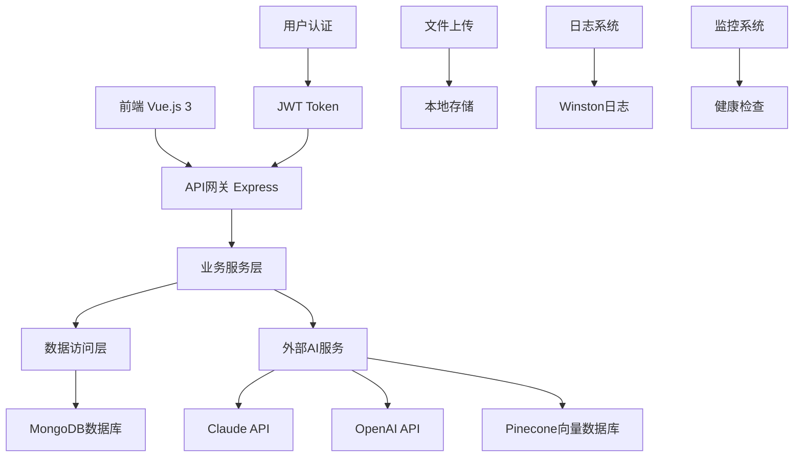
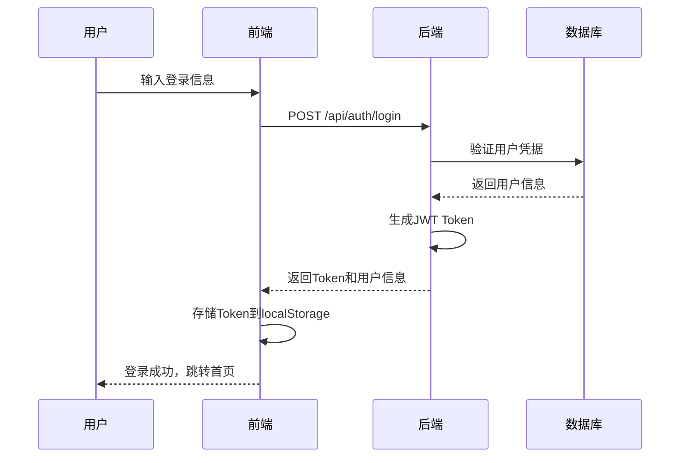
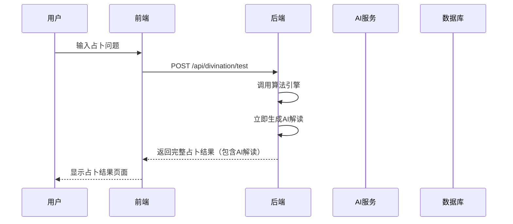

# 梅花心易项目技术架构与开发指南

## 📋 项目概述

**项目名称**: 梅花心易智能占卜平台  
**技术架构**: 前后端分离 + 云原生部署  
**核心功能**: 梅花易数算法 + AI智能解读 + RAG知识库 + 占卜顾问  
**开发状态**: 基础架构已搭建，核心功能开发中

### 🎯 核心功能
- 梅花易数占卜算法
- AI智能解读
- 用户认证与管理
- 占卜历史记录
- 移动端优化

### 🛠️ 技术栈
- **前端**: Vue.js 3 + Vite + Element Plus + Pinia + TailwindCSS
- **后端**: Node.js + Express + MongoDB + JWT认证
- **AI服务**: DeepSeek + Claude + Pinecone向量数据库
- **部署**: 支持本地开发和生产环境部署

---

## 🏗️ 项目架构概览



---

## 📁 项目文件结构

### 根目录结构
```
MeiHuaXinYi/                           # 项目根目录
├── 📁 backend/                        # 后端服务目录
├── 📁 frontend/                       # 前端应用目录  
├── 📁 design/                         # 设计文档目录
├── 📁 docs/                          # 项目文档目录
├── 📄 package.json                    # 根项目配置文件
├── 📄 start-dev.js                    # 一键启动开发环境脚本
├── 📄 README.md                       # 项目说明文档
└── 📄 实施完成总结汇总.md             # 项目完成总结
```

### 根目录核心文件功能

#### 📄 package.json
- **功能**: 项目主配置文件，定义工作空间和统一脚本
- **核心脚本**:
  - `npm run dev`: 一键启动前后端开发环境
  - `npm run build`: 构建前后端生产版本
  - `npm run install:all`: 安装所有依赖
  - `npm run test`: 运行所有测试

#### 📄 start-dev.js
- **功能**: 智能开发环境启动器
- **特性**: 
  - 并行启动前后端服务
  - 实时日志输出和颜色标识
  - 自动检测启动状态
  - 优雅的进程管理和清理

---

## 🔧 Backend 后端服务架构

### 📁 backend/ 目录结构
```
backend/
├── 📁 src/                           # 源代码目录
│   ├── 📁 algorithms/                # 梅花易数算法核心
│   │   ├── 📁 core/                  # 算法核心模块
│   │   ├── 📁 data/                  # 卦象数据文件
│   │   └── 📁 validators/            # 算法验证器
│   ├── 📁 config/                    # 配置文件
│   ├── 📁 controllers/               # 控制器层
│   ├── 📁 middleware/                # 中间件
│   ├── 📁 models/                    # 数据模型
│   ├── 📁 routes/                    # 路由定义
│   ├── 📁 services/                  # 业务逻辑层
│   ├── 📁 utils/                     # 工具函数
│   ├── 📁 ai/                        # AI服务模块
│   ├── 📄 app.js                     # Express应用配置
│   └── 📄 server.js                  # 服务器启动文件
├── 📁 scripts/                       # 脚本工具
├── 📁 docs/                          # 后端文档
├── 📁 examples/                      # 示例代码
├── 📁 logs/                          # 日志文件
└── 📄 package.json                   # 后端依赖配置
```

### 🧠 核心模块详解

#### 📁 algorithms/ - 梅花易数算法引擎
- **core/**: 算法核心实现
  - `meihuaDivinationCore.js`: 占卜核心引擎
  - `BaguaSystem.js`: 八卦系统
  - `FiveElementsSystem.js`: 五行分析
  - `HexagramCalculation.js`: 卦象计算
- **data/**: 基础数据
  - `hexagrams.json`: 六十四卦数据
  - `bagua.json`: 八卦属性
  - `wuxing.json`: 五行关系

#### 📁 models/ - 数据模型层
- `User.js`: 用户模型（认证、档案、订阅）
- `Divination.js`: 占卜记录模型
- `Conversation.js`: 对话记录模型（AI顾问）
- `KnowledgeBase.js`: 知识库模型（RAG系统）

#### 📁 controllers/ - 控制器层
- `authController.js`: 用户认证控制器
- `divination.controller.js`: 占卜功能控制器
- `enhancedDivination.controller.js`: 增强占卜控制器
- `userController.js`: 用户管理控制器

#### 📁 services/ - 业务逻辑层
- `divination.service.js`: 占卜业务逻辑
- `divinationInterpretation.service.js`: AI解读服务
- `emailService.js`: 邮件服务

#### 📁 ai/ - AI服务模块
- `aiManager.js`: AI服务管理器
- `deepseekAPI.js`: DeepSeek API集成

### 🔌 后端技术栈
- **框架**: Express.js 5.1.0
- **数据库**: MongoDB + Mongoose
- **认证**: JWT + BCrypt
- **AI服务**: Claude API + OpenAI Embeddings
- **向量数据库**: Pinecone (已集成)
- **缓存**: Redis (可选)

---

## 🎨 Frontend 前端应用架构

### 📁 frontend/ 目录结构
```
frontend/
├── 📁 src/                           # 源代码目录
│   ├── 📁 api/                       # API接口层
│   │   ├── index.js                  # API统一管理
│   │   ├── auth.js                   # 认证相关API
│   │   ├── divination.js             # 占卜相关API
│   │   └── request.js                # HTTP请求封装
│   ├── 📁 assets/                    # 静态资源
│   ├── 📁 components/                # 组件库
│   │   ├── 📁 business/              # 业务组件
│   │   ├── 📁 common/                # 通用组件
│   │   │   ├── MysticalCard.vue     # 神秘卡片组件
│   │   │   ├── MysticalButton.vue   # 神秘按钮组件
│   │   │   └── HexagramDisplay.vue  # 卦象展示组件
│   │   ├── 📁 layout/                # 布局组件
│   │   └── 📁 icons/                 # 图标组件
│   ├── 📁 router/                    # 路由配置
│   ├── 📁 stores/                    # 状态管理
│   ├── 📁 styles/                    # 样式文件
│   ├── 📁 utils/                     # 工具函数
│   ├── 📁 views/                     # 页面组件
│   │   ├── 📁 auth/                  # 认证页面
│   │   ├── 📁 divination/            # 占卜页面
│   │   └── 📁 user/                  # 用户页面
│   ├── 📄 App.vue                    # 根组件
│   └── 📄 main.js                    # 应用入口
├── 📁 public/                        # 公共资源
├── 📄 index.html                     # HTML模板
├── 📄 vite.config.js                 # Vite配置
├── 📄 tailwind.config.js             # TailwindCSS配置
└── 📄 package.json                   # 前端依赖配置
```

### 🎯 核心模块详解

#### 📁 stores/ - 状态管理 (Pinia)
- `app.js`: 应用全局状态
- `user.js`: 用户状态管理
- `divination.js`: 占卜状态管理

#### 📁 views/divination/ - 占卜页面
- `DivinationHome.vue`: 占卜首页
- `DivinationQuestion.vue`: 问题输入页
- `DivinationLoading.vue`: 占卜加载页
- `DivinationResult.vue`: 结果展示页
- `DivinationHistory.vue`: 历史记录页

#### 📁 styles/ - 样式系统
- `starry-theme.css`: 星空主题样式
- `mobile.css`: 移动端适配
- `element-overrides.css`: Element Plus样式覆盖

### 🔌 前端技术栈
- **框架**: Vue.js 3 + Composition API
- **构建工具**: Vite 7.0.6
- **状态管理**: Pinia 3.0.3
- **路由**: Vue Router 4.5.1
- **UI组件**: Element Plus 2.10.4
- **CSS框架**: TailwindCSS 4.1.11
- **工具库**: VueUse, Axios

---

## 🔌 API接口清单

### 1. 认证相关接口 (`/api/auth`)

#### 用户注册
```http
POST /api/auth/register
Content-Type: application/json

{
  "email": "user@example.com",
  "password": "password123",
  "username": "username",
  "phone": "13800138000"
}
```

#### 用户登录
```http
POST /api/auth/login
Content-Type: application/json

{
  "identifier": "user@example.com",
  "password": "password123"
}
```

#### 获取当前用户信息
```http
GET /api/auth/me
Authorization: Bearer <token>
```

#### 验证邮箱
```http
GET /api/auth/verify-email/:token
```

#### 发送登录验证码
```http
POST /api/auth/send-login-code
Content-Type: application/json

{
  "email": "user@example.com"
}
```

### 2. 占卜相关接口 (`/api/divination`)

#### 执行占卜（测试模式）
```http
POST /api/divination/test
Content-Type: application/json

{
  "question": "我的事业发展如何？",
  "method": "time",
  "params": {
    "datetime": "2024-01-15T14:30:00.000Z"
  }
}
```

#### 执行占卜（生产模式）
```http
POST /api/divination/perform
Authorization: Bearer <token>
Content-Type: application/json

{
  "question": "我的事业发展如何？",
  "method": "time",
  "params": {
    "time": {
      "year": 2024,
      "month": 1,
      "day": 15,
      "hour": 14
    }
  }
}
```

#### 生成AI解读
```http
POST /api/divination/:id/interpretation
Authorization: Bearer <token>
Content-Type: application/json

{
  "divinationData": {
    "hexagrams": { /* 卦象数据 */ },
    "question": "问题内容"
  }
}
```

### 3. 用户相关接口 (`/api/user`)

#### 获取用户资料
```http
GET /api/user/profile
Authorization: Bearer <token>
```

#### 更新用户资料
```http
PUT /api/user/profile
Authorization: Bearer <token>
Content-Type: application/json

{
  "nickname": "新昵称",
  "gender": "male",
  "birthDate": "1990-01-01",
  "phone": "13800138000"
}
```

### 4. 系统接口

#### 健康检查
```http
GET /api/health
```

**响应示例**:
```json
{
  "success": true,
  "data": {
    "status": "healthy",
    "timestamp": "2024-01-15T14:30:00.000Z",
    "uptime": 3600,
    "database": {
      "mongodb": { "status": "connected", "latency": 15 }
    }
  }
}
```

---

## 🔄 数据流向分析

### 1. 用户登录流程


### 2. 占卜执行流程


---

## 🔐 认证与授权机制

### JWT Token结构
```javascript
// Header
{
  "alg": "HS256",
  "typ": "JWT"
}

// Payload
{
  "userId": "user_id",
  "email": "user@example.com",
  "type": "access",
  "iat": 1642248000,
  "exp": 1642851200
}
```

### 权限验证流程
1. **前端**: 每次API请求在Header中携带`Authorization: Bearer <token>`
2. **后端**: 中间件验证Token有效性和用户权限
3. **刷新机制**: Token过期时使用RefreshToken自动刷新

### 路由保护
- **前端路由守卫**: 检查登录状态，未登录重定向到登录页
- **后端中间件**: 验证Token，无效Token返回401错误

---

## 🚀 开发环境启动指南

### 前置条件检查

#### 1. Node.js 版本要求
```bash
# 检查当前Node.js版本
node --version

# 要求版本：^20.19.0 || >=22.12.0
```

#### 2. 项目依赖安装
```bash
# 安装根目录依赖
npm install

# 分别安装前后端依赖
cd frontend && npm install
cd ../backend && npm install
```

#### 3. 端口可用性检查
```bash
# Windows系统检查端口占用
netstat -ano | findstr :3001  # 后端端口
netstat -ano | findstr :5173  # 前端端口
```

### 服务启动

#### 方式1：一键启动（推荐）
```bash
# 在项目根目录执行
npm run dev
```

这将同时启动：
- 后端服务：http://localhost:3001
- 前端服务：http://localhost:5173

#### 方式2：分别启动
```bash
# 启动后端服务器
cd backend
npm start  # 或 node src/server.js

# 启动前端开发服务器（新终端）
cd frontend
npm run dev
```

### 验证服务

#### 1. 后端健康检查
```bash
curl http://localhost:3001/api/health
```

#### 2. 前端访问
浏览器打开：http://localhost:5173

### 常见问题

#### 端口占用问题
```bash
# 终止占用端口的进程
taskkill /PID <进程ID> /F  # Windows
kill -9 <进程ID>           # Linux/Mac
```

#### 依赖包缺失问题
```bash
cd backend && npm install
cd ../frontend && npm install
```

#### 数据库连接问题
检查 `backend/.env` 文件中的MongoDB连接字符串

---

## 🔄 生产环境部署

### 后端Express静态文件服务

在 `backend/src/app.js` 中配置：

```javascript
// 生产环境下提供前端静态文件服务
if (process.env.NODE_ENV === 'production') {
  app.use(express.static(path.join(__dirname, '../../frontend/dist')));

  // 处理Vue Router的history模式
  app.get('*', (req, res) => {
    // 跳过API路由
    if (req.path.startsWith('/api/')) {
      return next();
    }
    res.sendFile(path.join(__dirname, '../../frontend/dist/index.html'));
  });
}
```

### 构建脚本
```bash
# 构建前端
cd frontend && npm run build

# 启动生产服务器
cd backend && npm start
```

---

## 📊 项目状态总结

### ✅ 已完成
- 项目基础架构搭建
- 前后端开发环境配置
- 用户认证系统
- 梅花易数算法实现
- AI解读系统集成
- 前端UI组件系统
- 数据库模型设计

### 🔄 开发中
- 数据库数据完善
- AI解读优化
- 前端交互优化

### 📋 待开发
- RAG知识库完善
- AI占卜顾问功能
- 完整的测试覆盖

---

## ⚠️ 技术架构注意事项

### 🔴 高优先级
1. **核心算法已实现**：梅花易数算法在 `backend/src/algorithms/` 目录
2. **AI解读已集成**：使用真实占卜数据生成解读
3. **数据库连接正常**：MongoDB Atlas云数据库

### 🟡 中优先级
1. **模拟数据替换**：逐步替换为真实数据
2. **错误处理完善**：统一错误处理机制
3. **性能优化**：添加缓存机制

### 🟢 低优先级
1. **代码规范化**：ESLint和Prettier配置
2. **监控和日志**：完善日志记录
3. **安全加固**：API限流、数据加密

---

## 📚 新手学习路径

### 🎯 第一阶段：理解项目结构（1-2周）
1. 熟悉Vue.js 3 Composition API
2. 了解Node.js和Express框架
3. 掌握MongoDB基础操作
4. 理解前后端分离架构

### 🎯 第二阶段：核心功能开发（2-3周）
1. 研究梅花易数理论
2. 实现占卜算法
3. 添加五行分析逻辑
4. 完善API接口

### 🎯 第三阶段：功能增强（2-3周）
1. 学习Claude API使用
2. 实现AI解读功能
3. 优化提示词设计
4. 完善前端交互

### 🎯 第四阶段：质量保障（1-2周）
1. 编写单元测试
2. 进行集成测试
3. 性能优化
4. 部署配置

---

## 📖 推荐学习资源

### 技术文档
- [Vue.js 3 官方文档](https://vuejs.org/)
- [Express.js 官方文档](https://expressjs.com/)
- [MongoDB 官方文档](https://docs.mongodb.com/)
- [Pinia 状态管理](https://pinia.vuejs.org/)

### 梅花易数相关
- 《梅花易数》原著
- 现代梅花易数解读书籍
- 易学基础理论学习

---

## 🎉 项目总结

### ✅ 项目优势
1. **架构设计合理**：前后端分离，职责清晰
2. **技术栈现代化**：使用最新的Vue.js 3和Node.js技术
3. **代码结构清晰**：良好的目录组织和模块化设计
4. **扩展性良好**：支持AI服务集成和功能扩展
5. **配置管理完善**：支持多环境配置，便于部署
6. **安全机制健全**：JWT认证、CORS配置、输入验证等

### 🚀 发展建议
1. **核心算法**：继续完善梅花易数算法准确性
2. **API对接**：完全替换模拟数据为真实API
3. **AI服务**：优化AI解读质量和响应速度
4. **测试优化**：添加测试用例，性能优化

### 📊 技术指标目标
- **代码质量**：测试覆盖率 > 80%
- **性能指标**：API响应时间 < 2秒
- **用户体验**：页面加载时间 < 3秒
- **系统稳定性**：可用性 > 99%

---

**文档版本**: v2.0  
**创建日期**: 2025年1月26日  
**最后更新**: 2025年1月26日  
**维护者**: 梅花心易开发团队

